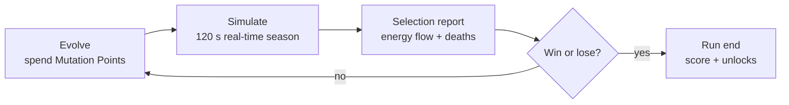
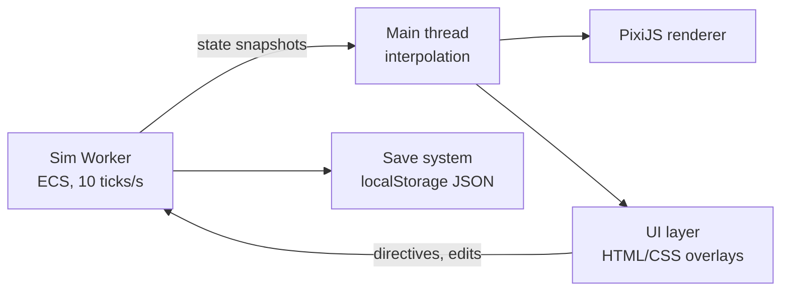

# Keystone — Game Design Document

Sep 22, 2026 · @Matt

## Overview

Keystone is a single-player HTML5 evolution strategy game: you design a species, drop it into a living food web, and evolve it generation by generation until it outcompetes or wipes out every rival NPC species.

**High concept:** "Spore's creature editor meets a real energy pyramid." Every calorie in the world starts as sunlight, and every trophic step loses most of it. Power in Keystone is measured in energy units (EU), and the player wins by capturing a larger share of the flow than anyone else.

**Design pillars**

- **Energy is the only currency.** Growth, movement, armor, reproduction and even thinking bigger cost EU. Nothing is free.
- **Every trait is a trade-off.** A bigger body hits harder but burns more energy each tick. Specialists digest better; generalists survive shocks.
- **The ecosystem pushes back.** NPC species also evolve between rounds, and over-hunting your prey starves you next round.
- **Readable systems.** Players can always see where energy went and why their creatures died.

**Platform:** desktop and mobile browsers (HTML5 Canvas/WebGL), no install, mouse and touch. Session length 20–45 minutes per biome run.

**Player fantasy:** "I shaped a lineage that took over the world, and I understood the ecology well enough to do it."

**Audience:** strategy and sim fans, plus students and teachers who want an intuitive feel for trophic efficiency (the "10% rule").

## Core loop

One round equals one generation, and each round runs four phases: Evolve, Simulate, Selection report, then back to Evolve.



The loop repeats until a victory or defeat condition triggers, typically 15–30 rounds per biome.

### Phase 1 — Evolve (untimed)

- The player spends **Mutation Points (MP)** earned last round on traits in the species editor.
- Three random **mutation cards** are offered each round at a discount; targeted upgrades cost full price.
- The editor shows the live upkeep cost (EU per tick) of the current build so every choice has a visible price.
- Round 1 starts with 20 MP and a founder template (see Player species).

### Phase 2 — Simulate (120 s at 1×, speed 1×/2×/4×)

- The ecosystem runs in real time: sunlight falls, producers grow, NPCs and the player's population forage, hunt, flee, breed and die.
- Creatures act on their own via utility AI. The player steers them with **Directives** (Forage, Hunt, Hide, Migrate, Swarm) and a movable **Territory marker**, each on a cooldown.
- A season cycle (spring → summer → autumn → winter) runs within each round, changing sunlight from 130% down to 50%.
- Pause is always available and lets the player inspect any organism.

### Phase 3 — Selection report

- An energy flow diagram shows how many EU the player's species ate, from which sources, and how much was lost to metabolism, predators and starvation.
- A population chart shows every species over the round, highlighting rivals that declined.
- Causes of death are ranked (for example, "41% eaten by Packjaws, 22% starved in winter").
- MP for next round are awarded here (see Win, lose and scoring).

## Energy model

All energy enters as sunlight, flows one way up the food chain, and leaks out as heat at every step; only nutrients recycle. The simulation enforces conservation: total EU in bodies + EU lost as heat = total sunlight captured, checked every tick in debug builds.

### Sunlight

- The world is a 64 × 64 tile grid. Each tile receives **10 EU per tick** at 100% light (10 ticks per second).
- Light is modified by season (50–130%), terrain (canopy shade −40%, open water −20%), and world events (drought, volcanic winter).
- Unused sunlight is lost. Producers compete for it by height and leaf area, so tall producers shade short ones.

### Producers

A producer captures light on its tile, burns part of it to stay alive, and stores the rest as body energy.

```latex
E_{body} \mathrel{+}= L_{tile} \times C_{photo} \times (1 - R_{plant})
```

`L` is light on the tile, `C_photo` is capture efficiency (default 0.20), and `R_plant` is respiration (default 0.50). So producers store about **10% of incident sunlight**. Producer growth is capped by soil nutrients, which decomposers return from dead bodies.

### Consumers

When any animal eats, only part of the meal becomes usable energy, and only part of that becomes body.

```latex
E_{body} \mathrel{+}= E_{eaten} \times A_{diet} \times P_{metab}
```

- **Assimilation efficiency `A`** is the fraction digested rather than excreted. It depends on the food type and the eater's gut: plants are hard to digest, meat is easy.
- **Production efficiency `P`** is the fraction of assimilated energy kept after respiration. Warm-blooded (endotherm) builds have low P but stay active in winter; cold-blooded (ectotherm) builds have high P but slow down in the cold.
- Uneaten remains and feces go to the **detritus pool**, feeding decomposers and soil nutrients but never giving EU back to consumers.

### Upkeep

Every organism also pays a basal metabolic cost each tick, scaled by body mass with Kleiber's law, plus a cost for each active trait.

```latex
U_{tick} = k \times M^{0.75} + \sum trait_{upkeep} + activity
```

Default `k` = 0.02 EU per tick. If body energy falls below 20% of maximum, the creature starts starving (−50% speed, no breeding); at 0 it dies and becomes carrion.

### Default transfer efficiencies

These defaults produce a pyramid close to the real-world "10% rule", tuned slightly upward so higher levels stay playable.

| Trophic level | Eats | Assimilation A | Production P | Net transfer | EU per round (1,000,000 EU sunlight) |
| --- | --- | --- | --- | --- | --- |
| Producers | Sunlight | 0.20 (capture) | 0.50 | 10% | 100,000 |
| Herbivores | Producers | 0.50 | 0.30 | 15% | 15,000 |
| Omnivores | Producers + animals | 0.35 plants / 0.70 meat | 0.25 | 9–18% | varies |
| Primary carnivores | Herbivores, omnivores | 0.80 | 0.15 | 12% | 1,800 |
| Secondary carnivores | Primary carnivores, omnivores | 0.80 | 0.12 | ~10% | 180 |

Omnivores are generalists by design: they can switch food when prey crashes, but they digest each food type less efficiently than a specialist.

### Why this matters for play

- A secondary carnivore gets roughly 1/5,000 of the sunlight that reached the world, so apex builds support tiny populations and every individual matters.
- Moving your species down a level (more plant eating) multiplies available energy about 8×, at the cost of predator exposure.
- Raising `A` or `P` through evolution is the single strongest way to outcompete a rival that eats the same food.

## Ecosystem and NPC organisms

The starter biome (Temperate Meadow) holds 14 NPC species across five roles, each with a clear niche the player can compete with or exploit.

| Species | Role | Size (mass) | Eats | Key behavior | Weakness to exploit |
| --- | --- | --- | --- | --- | --- |
| Sunmoss | Producer | 1 | Sunlight | Ground cover, regrows in 8 s | Low EU density, shaded out by tall plants |
| Reedstalk | Producer | 4 | Sunlight | Grows tall, shades neighbors | Slow regrowth after grazing |
| Bloomvine | Producer | 2 | Sunlight | Drops fruit (A +0.2 for eaters) | Fruits only in spring and summer |
| Ironbark | Producer | 12 | Sunlight | Huge energy store, tough bark | High handling time to eat |
| Grazeling | Herbivore | 3 | Sunmoss, Reedstalk | Herds of 10–30, stampede when attacked | Overgrazes and crashes in winter |
| Burrow Hopper | Herbivore | 1 | Sunmoss, Bloomvine | Breeds fast (r-strategist), hides in burrows | Tiny energy per kill |
| Tuskbeast | Herbivore | 10 | Ironbark, Reedstalk | Charges predators, slow breeder | Calves unprotected at herd edges |
| Scuttler | Omnivore | 2 | Fruit, carrion, eggs | Scavenges kills, flees everything | Low speed, predictable routes |
| Thornback | Omnivore | 5 | Plants, Burrow Hoppers | Spined, costly to attack | Poor senses, easy to ambush |
| Stalker | Primary carnivore | 4 | Grazelings, Hoppers | Solo ambush from tall cover | Weak in open ground |
| Packjaw | Primary carnivore | 5 | Grazelings, Scuttlers | Hunts in packs of 3–6 | Pack collapses if the alpha dies |
| Glidewing | Primary carnivore | 2 | Hoppers, Scuttlers | Aerial, dives from above | Grounded in rain events |
| Dreadmaw | Secondary carnivore | 14 | Packjaws, Stalkers, Tuskbeasts | Apex, territorial, 2–4 individuals | Very high upkeep; starves fast |
| Rotmite | Decomposer | 0.2 | Detritus, carrion | Returns nutrients to soil | Not a rival; killing them hurts producers |

### NPC behavior

- **Utility AI:** each creature scores actions (eat, hunt, flee, rest, breed, migrate) every 0.5 s from four needs: hunger, fear, reproduction and fatigue.
- **Senses:** sight radius and smell radius limit what an NPC knows. Camouflage and stealth traits reduce the chance of being noticed.
- **Breeding:** an NPC breeds when body energy exceeds its breeding threshold, splitting a fixed share of its EU into offspring. Energy is never created on birth.
- **NPC evolution (Red Queen):** between rounds each NPC species gets 1–3 small stat shifts driven by what killed it most. If the player hunts Grazelings heavily, Grazelings gain speed or herd size. Difficulty sets the strength of this response.
- **Population floors:** no species respawns once extinct unless an event reintroduces it, so extinctions are permanent and meaningful.

## Player species

The player's species is a genome of numeric traits bought with Mutation Points; every point of capability also adds upkeep, so the best builds are efficient, not maximal.

### Founder templates (round 1)

The player picks a starting niche, which sets the diet slider and starting traits. Diet can shift later through evolution.

| Template | Starting niche | Starting population | Strength | Risk |
| --- | --- | --- | --- | --- |
| Grazer | Herbivore | 20 | Huge energy base | Hunted by everything |
| Opportunist | Omnivore | 12 | Flexible diet | Mediocre digestion |
| Hunter | Primary carnivore | 8 | Strong offense | Depends on prey numbers |
| Tyrant | Secondary carnivore | 3 | Kills anything | Tiny, fragile population (hard mode) |

### Trait genome

| Trait | Effect | MP per level | Upkeep per level (EU/tick) | Max level |
| --- | --- | --- | --- | --- |
| Body size | +1 mass: more HP, bite and energy storage | 3 | via Kleiber mass cost | 15 |
| Speed | +8% move speed | 2 | 0.010 | 8 |
| Senses | +10% sight and smell radius | 2 | 0.005 | 6 |
| Diet slider | Shifts 10% between plant and meat | 1 | 0 | n/a |
| Plant gut | +0.05 plant assimilation | 3 | 0.004 | 5 |
| Meat gut | +0.05 meat assimilation | 3 | 0.004 | 3 |
| Metabolism | Toggle endotherm (P −0.05, full winter activity) or ectotherm (P +0.08, −40% speed below 60% light) | 4 | 0 | toggle |
| Armor | −10% damage taken | 3 | 0.008 | 5 |
| Spines / toxin | Reflects 15% damage or poisons attacker | 4 | 0.006 | 3 |
| Bite / claws | +12% damage | 3 | 0.006 | 6 |
| Venom | Damage over time, prey slows | 5 | 0.010 | 3 |
| Camouflage | −15% chance to be detected | 3 | 0.004 | 4 |
| Sociality | Herd (shared vigilance) or pack (coordinated hunts) | 4 | 0.003 | 4 |
| Reproduction | r-strategy (many cheap young) to K-strategy (few strong young) | 2 | 0 | slider |
| Fat reserves | +15% max energy storage, −5% speed | 2 | 0.002 | 4 |

### Mutation cards

- Each Evolve phase offers 3 random cards at a 30% MP discount, drawn from traits adjacent to the current build.
- Rare cards (5% chance) unlock special organs: **Symbiotic gut** (+0.15 plant A), **Echolocation** (see through cover), **Hibernation** (upkeep −70% in winter, no activity), **Flight** (ignores terrain, +50% upkeep).
- One free **reroll** per round; more cost 2 MP each.
- **Devolve:** selling a trait level refunds 50% of its MP, so players can pivot niches.

### Emergent niche shifts

The diet slider and gut traits let a lineage climb or descend the pyramid over many rounds. A Grazer that invests in meat gut and bite can become an omnivore, then a primary carnivore, but its efficiency lags a true specialist until the matching gut is maxed.

## Win, lose and scoring

The player wins by defeating every designated rival species; they lose if their own lineage dies out or the ecosystem they depend on collapses.

### Rivals and defeat

- Each biome names 4–6 **rival species**: NPCs that share the player's food source or prey on the player. The rival list updates when the player shifts niche.
- A rival is **defeated** when it goes extinct, or stays below 10% of its starting population for 2 consecutive rounds.
- Rivals can be defeated directly (hunting them), by competition (eating their food first and better), or indirectly (wiping out their prey).

### Victory

- **Dominance victory:** all rivals defeated while the player species holds at least 35% of the biomass at its trophic level.
- **Apex victory (alternate):** player species holds 50% of all consumer biomass for 3 consecutive rounds.

### Defeat

- **Extinction:** player population reaches 0.
- **Collapse:** producer biomass falls below 15% of its starting value for 2 rounds, because the whole pyramid starves.
- **Round limit:** 30 rounds without victory ends the run with a score but no win.

The Collapse rule creates the core tension: driving prey extinct defeats a rival but can starve the player's own species the round after.

### Mutation Points earned per round

```latex
MP = 5 + \lfloor offspring / 4 \rfloor + \lfloor E_{banked} / 500 \rfloor + 3 \times rivals\_defeated\_this\_round
```

The MP formula is capped at 25 per round to prevent snowballing; a species that shrinks earns fewer MP but gets a +3 **adaptive pressure** bonus to help comebacks.

### Final score

Score = total EU assimilated across all rounds + 1,000 per rival defeated + 5,000 for victory − 100 per round used, multiplied by difficulty (0.75× / 1× / 1.5×).

## Progression, difficulty and events

A campaign of four biomes unlocks in order, each changing the energy budget and the rival roster; difficulty mainly tunes how hard NPCs evolve back.

### Biomes

| Biome | Sunlight modifier | Defining twist | Unlocks after |
| --- | --- | --- | --- |
| Temperate Meadow | 100% | Tutorial-friendly; balanced pyramid | Start |
| Mangrove Wetland | 110% | Water tiles; aquatic and amphibious rivals | Meadow victory |
| Taiga | 70% | Long winters; endotherm vs ectotherm matters | Wetland victory |
| Volcanic Isles | 90% | Isolated islands; migration and flight traits pay off | Taiga victory |

A **Sandbox** mode unlocks after the Meadow, with editable sunlight, efficiencies and starting rosters.

### Difficulty

| Setting | NPC mutations per round | NPC response strength | Starting MP | Score multiplier |
| --- | --- | --- | --- | --- |
| Seedling | 1 | 50% | 25 | 0.75× |
| Standard | 2 | 100% | 20 | 1× |
| Apex | 3 | 150% | 15 | 1.5× |

### World events

From round 4 onward, each round has a 25% chance of one event, announced at the start of the Evolve phase so the player can adapt.

| Event | Effect | Duration |
| --- | --- | --- |
| Drought | Sunlight −30%, water tiles shrink | 1 round |
| Volcanic winter | Sunlight −50%, ectotherms slowed all round | 2 rounds |
| Invasive species | A new NPC species arrives in one corner | Permanent |
| Plague | The most populous species loses 30% of individuals | Instant |
| Bloom | Producer growth +50% | 1 round |
| Migration wave | A herd of herbivores crosses the map | 1 round |

### Meta-progression

- Victories unlock new founder templates, rare mutation cards and cosmetic body parts.
- A **Codex** records every species met, with real-world ecology notes on trophic efficiency, keystone species and trophic cascades.

## UI/UX and controls

Three screens carry the game — World view, Species editor and Selection report — and each keeps the energy pyramid visible so players always see the stakes.

### World view (Simulate phase)

- Top-down 2D map with pan and zoom. Organisms are color-coded by trophic level: green producers, yellow herbivores, orange omnivores, red primary carnivores, purple secondary carnivores, grey decomposers.
- **Top bar:** round number, season, timer, speed controls (pause, 1×, 2×, 4×).
- **Left panel:** live trophic pyramid showing EU per level, with the player's share highlighted.
- **Right panel:** player population, average body energy, births and deaths this round, rival status icons.
- **Bottom bar:** Directive buttons with cooldown rings, and the Territory marker tool.
- Clicking any organism opens an inspector: species, energy bar, current action and what it is hunting or fleeing.

### Species editor (Evolve phase)

- A creature preview assembled from body-part sprites that change as traits level up (bigger jaws, spines, fur).
- Trait cards grouped by category with MP cost, upkeep cost and a one-line effect.
- A **radar chart** of offense, defense, speed, senses, efficiency and fertility.
- An **upkeep meter** comparing projected EU income against EU spend, turning red when the build is predicted to starve.
- Mutation card tray with reroll button.

### Selection report

- Energy flow (Sankey) diagram: sources eaten → assimilated → body growth, with losses to heat, excretion and predation.
- Population line chart for all species over the round.
- Top three causes of death and top three energy sources.
- MP award breakdown and "Continue to Evolve" button.

### Controls

| Action | Mouse / keyboard | Touch |
| --- | --- | --- |
| Pan | Drag or WASD | One-finger drag |
| Zoom | Scroll wheel | Pinch |
| Inspect organism | Left-click | Tap |
| Place territory marker | Right-click or T | Long-press |
| Directives | 1–5 keys or buttons | Buttons |
| Pause | Space | Pause button |
| Speed | + / − | Speed buttons |

### Onboarding

A 3-round guided Meadow tutorial introduces one concept per round: round 1 sunlight and eating, round 2 upkeep and starvation, round 3 predators and rivals.

## Technical architecture

The game is a TypeScript client-only web app: a deterministic fixed-step simulation in a Web Worker, rendered at 60 fps on the main thread with PixiJS (WebGL, Canvas fallback).



The sim never touches the DOM, so the UI stays responsive even at 4× speed with 2,000 entities.

### Simulation

- **Entity Component System** with components for Position, Body (mass, EU, max EU), Genome, Diet, Senses, Brain (utility scores), Producer (leaf area, height) and Carrion.
- **Systems run in order each tick:** Sunlight → Photosynthesis → Upkeep → Perception → Decision → Movement → Combat → Feeding → Reproduction → Death/Decay → Nutrient cycle → Ledger.
- **Energy ledger:** every EU change is booked to a source and sink (sunlight, body, heat, detritus). Debug builds assert conservation within 0.1% each tick, and the ledger feeds the Sankey report.
- **Spatial hash grid** (cell size 32 px) for neighbor and perception queries.
- **Seeded RNG** (mulberry32) so a seed plus the player's inputs reproduces a run exactly, useful for bug reports and daily challenges.

### Rendering and UI

- Creatures drawn from sprite-part atlases assembled per genome, cached as render textures per species.
- Level-of-detail: beyond zoom 0.5×, organisms render as colored dots; producers render as a tinted tile heatmap.
- UI in plain HTML/CSS overlays (or Preact) for accessibility and easy text scaling; charts via a lightweight library such as uPlot.

### Performance budget

| Item | Target |
| --- | --- |
| Max active consumers | 2,000 |
| Producer tiles | 4,096 (64 × 64) |
| Sim tick cost | ≤ 8 ms on a mid-range laptop at 4× speed |
| Render frame | ≤ 12 ms at 60 fps |
| Initial download | ≤ 10 MB |

### Save and platform

- Autosave at the start of each Evolve phase to localStorage as versioned JSON (about 200 KB), with export/import as a file.
- Installable as a PWA for offline play; no server or account needed.
- Supported: current Chrome, Edge, Firefox and Safari, including iOS and Android tablets.

## Art and audio direction

The look is a clean, flat-shaded "field guide" style with bold trophic colors, so a crowded ecosystem stays readable at a glance.

### Visual style

- Flat vector shapes with soft outlines, inspired by natural-history illustration rather than realism.
- Each creature is built from 5–8 modular parts (body, head, jaws, limbs, back, tail, pattern), so every trait level has a visible change.
- Trophic color language is fixed across all screens; patterns and shapes also differ by level so the game works for color-blind players.
- Energy is visualized as small glowing motes: gold from the sun into plants, then flowing to eaters on each bite, and red-orange heat puffs rising from active creatures.
- Seasons tint the whole palette: fresh greens in spring, gold in autumn, pale blue in winter.

### Audio

- Generative ambient score (Web Audio API) whose layers follow the season and the player's population trend.
- Short, distinct sound cues: bite, kill, birth, starvation warning, rival defeated, extinction.
- Creature calls synthesized from genome traits, so a big-bodied species sounds deeper.
- All sounds under 1.5 MB total; separate volume sliders for music and effects.

## Balancing and tuning parameters

All tuning lives in one data file (`balance.json`) so designers can rebalance without code changes; these are the launch defaults.

| Parameter | Default | Range to test | Notes |
| --- | --- | --- | --- |
| Sunlight per tile per tick | 10 EU | 6–15 | Master knob for total world energy |
| Producer capture `C_photo` | 0.20 | 0.10–0.30 | Real plants ~0.01–0.03; raised for playability |
| Producer respiration `R_plant` | 0.50 | 0.40–0.60 | |
| Herbivore assimilation (plants) | 0.50 | 0.35–0.65 | |
| Carnivore assimilation (meat) | 0.80 | 0.70–0.90 | |
| Omnivore assimilation | 0.35 plant / 0.70 meat | ±0.10 | Generalist penalty |
| Endotherm P modifier (vs level default) | −0.05 | −0.10 to 0 | |
| Ectotherm P modifier (vs level default) | +0.08 | +0.04 to +0.15 | |
| Basal metabolic constant `k` | 0.02 EU/tick | 0.01–0.04 | Applied to mass^0.75 |
| Starvation threshold | 20% max EU | 10–30% | |
| Breeding threshold | 80% max EU | 60–90% | Offspring take 40% of parent EU |
| Carrion decay | 2% per tick | 1–5% | Scavenger window |
| Round length | 120 s (1,200 ticks) | 90–180 s | |
| MP cap per round | 25 | 20–35 | Anti-snowball |
| Rival defeat threshold | < 10% start pop for 2 rounds | 5–15% | |
| Collapse threshold | < 15% producer biomass for 2 rounds | 10–20% | |

### Balancing targets

- Standard difficulty: a median player wins the Meadow in 18–24 rounds.
- No single trait should appear in more than 60% of winning builds (tracked via optional telemetry or playtest logs).
- Each founder template should reach victory at least 30% of the time for experienced testers.
- Pyramid shape check: at round 1, EU per level should drop by 5–10× per step up.

## Scope, milestones and open questions

The MVP is one biome (Temperate Meadow), all four founder templates and the full energy model, buildable by a 1–2 person team in about 16 weeks.

### Milestones

| Milestone | Deliverable | Duration |
| --- | --- | --- |
| M1 Energy sandbox | Sunlight, producers, one herbivore, energy ledger passing conservation checks | 3 weeks |
| M2 Food web | All 14 Meadow NPCs with utility AI, predation, carrion and decomposers | 4 weeks |
| M3 Player species | Founder templates, trait genome, species editor, directives | 3 weeks |
| M4 Round loop | Evolve/Simulate/Report phases, MP, rivals, win/lose, NPC evolution | 3 weeks |
| M5 Polish MVP | Tutorial, Sankey report, audio, save system, performance pass | 3 weeks |
| Post-MVP | Wetland, Taiga, Volcanic Isles biomes; Sandbox; events expansion | 8–12 weeks |

### Out of scope for MVP

- Multiplayer or shared leaderboards.
- Plant (producer) player species.
- Multiple player species at once.

### Open questions

- [ ] Should the player ever directly control an "alpha" individual, or stay purely indirect through directives?
- [ ] Is 120 s the right round length on mobile, where sessions are shorter?
- [ ] Should NPC evolution be visible (showing their new traits) or hidden until discovered in the inspector?
- [ ] Should real-world efficiency values be offered as an optional "Realism" mode for classroom use?
- [ ] Can a producer-player mode be a later expansion, competing for sunlight instead of prey?
