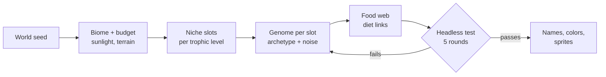

# Keystone — Phase 2 Design: Living Genomes

Sep 23, 2026 · @Matt

## Overview

Phase 2 turns species from fixed stat blocks into populations of individuals that each carry a heritable genome. Every world is seeded with randomly generated species that mutate, get selected and split into new species, and the player shapes their own lineage through breeding and selection pressure as well as the editor.

**What Phase 1 shipped:** 14 hand-authored Meadow species, one shared genome per species, and NPC evolution applied as 1–3 discrete +1 trait steps between rounds. Every individual of a species is identical, so evolution is a menu choice rather than something that happens inside the population.

**Phase 2 pillars**

- **Every world is new.** The roster, body plans, names and food web are generated from a seed, so no two runs share the same rivals.
- **Evolution is emergent.** Traits vary between individuals; the ones that eat, survive and breed pass their genes on. Nobody picks NPC mutations.
- **Species are real clusters.** When a population's genomes drift far enough apart, it splits into two species with their own names, colors and rival status.
- **The player is a breeder, not only a builder.** Mutation Points still buy traits, but the player can also select breeders, set pressures and protect bloodlines.
- **Still readable.** Trait distributions, lineage trees and "why this changed" reports keep the evolution legible.

**Scope:** the Temperate Meadow and a new generated-biome mode, built on the existing `sim.js` energy model and ledger. Energy rules, the round loop and the win conditions from Phase 1 stay as they are unless a section below changes them.

## Procedural species generation

A world seed generates 10–16 consumer species and 3–6 producers by filling niche slots in a trophic template, then rejects any roster whose food web fails a 5-round headless stability test.

### Generation pipeline



Each step draws from the seeded RNG, so a seed always reproduces the same roster.

### Niche slots

The biome's energy budget sets how many slots each level gets. A lower level must hold at least 5× the EU capacity of the level above it, which keeps the pyramid from Phase 1's 10% rule intact.

| Level | Slots (Meadow budget) | Archetypes drawn from |
| --- | --- | --- |
| Producers | 3–6 | ground cover, tall shader, fruiting vine, woody store, aquatic mat |
| Herbivores | 3–5 | herd grazer, r-strategist burrower, large browser, fruit specialist |
| Omnivores | 1–3 | scavenger, armored forager, opportunist |
| Primary carnivores | 2–4 | ambusher, pack hunter, aerial diver, venomous stalker |
| Secondary carnivores | 0–2 | apex territorial, apex scavenger |
| Decomposers | 1–2 | detritivore, carrion specialist |

### Genome construction

An archetype is a set of trait ranges, not fixed values. The generator samples each trait inside its archetype range, then spends a random 0–6 point "quirk budget" on off-archetype traits. A pack hunter might roll unusual armor, or a grazer might come out venomous.

- **Hard constraints:** diet must match the level, projected income must exceed upkeep by 10–40% (reusing the Phase 1 upkeep-meter projection), and mass must stay inside the level's band.
- **Diet links:** each consumer gets 1–4 prey or food links chosen by size ratio (prey mass ≤ 1.5× predator mass, or 3× for pack hunters). Every herbivore must have at least one predator, and every carnivore at least two prey species.
- **Special behaviors:** flags such as ambush, burrow, charge, pack and aerial become heritable traits with a gene value, rather than hard-coded species flags.

### Stability test

Before play, the generator runs the roster headless for 5 rounds with no player (the existing `tools/headless.js` path). A roster is rejected when any level goes extinct, producers fall below 30% of their start, or any species exceeds 40% of all consumers. It retries with a new sub-seed, up to 20 attempts; after that it falls back to the hand-authored Meadow roster.

### Identity

- **Names:** a two-part generator combining a morphology root (Thorn-, Glide-, Dusk-) with a behavior suffix (-maw, -hopper, -strider), weighted by the species' dominant traits. For example, a fast, armored grazer might come out as "Platestrider".
- **Color:** the trophic color stays fixed per level; each species gets a hue shift of ±20° plus a pattern (spots, stripes, bands) so species on the same level are distinguishable.
- **Art:** Phase 1's `drawCreature` already builds bodies from genome parts, so generated species get sprites for free. Phase 2 adds body-plan genes (limb count 2–6, tail type, head shape) to widen the silhouettes.

## Evolution model

Each individual carries its own genome of continuous gene values; offspring inherit a blend of two parents plus small mutations, and natural selection happens only through who eats, survives and breeds in the simulation.

### Genome representation

- **Genes are floats**, not integer levels. `bite = 2.37` means +28% damage. The trait's upkeep and effect scale continuously, so selection can make small gains.
- **Phase 1 trait levels map 1:1** to gene values, so `balance.js` costs and caps still apply: the Phase 1 max level becomes the gene's cap.
- **New gene types:** behavior genes (flee threshold, hunt aggression, herd cohesion, roam radius) and body-plan genes (limb count, tail type, head shape). Behavior genes feed the utility AI weights directly, so behavior evolves too.
- **Neutral marker genes** (8 floats with no effect) drift freely. They measure relatedness for speciation without being skewed by selection.

### Inheritance

Breeding needs a mate: a conspecific within 4 tiles whose body energy is also above the breeding threshold. Each offspring gene is the midparent value plus mutation:

```latex
g_{child} = \frac{g_{mother} + g_{father}}{2} + \mathcal{N}(0, \sigma_g) \quad \text{with probability } \mu, \text{ else no mutation term}
```

- **Default rates:** mutation chance μ = 0.15 per gene per birth; σ = 4% of the gene's range. Both go in `balance.js`, alongside a per-species mutability gene that can itself evolve.
- **Asexual fallback:** a lone individual with no mate within 12 tiles for 300 ticks clones itself with doubled μ, so small founder populations can still recover.
- **Energy is unchanged:** offspring still take 40% of parent EU, split between the two parents 50/50, so births never create energy and the ledger stays exact.

### Selection

There is no fitness function. Fitness is simply offspring count, which the energy economy already decides. Three pressures make selection visible within a few rounds:

- **Predation selects defense and speed:** slow or easily detected individuals are caught first, because the Phase 1 hunt scoring already prefers easy prey.
- **Starvation selects efficiency:** high-upkeep individuals starve first in winter.
- **Competition selects diet:** individuals whose gut genes match the most abundant food gain energy fastest and breed first.

### Speciation

A species splits when its population forms two genetic clusters. This check runs once per round, between rounds.

1. Compute each individual's genetic distance to the species centroid: normalized distance over all genes, with neutral markers weighted 2×.
2. Run 2-means clustering on the population.
3. Split when both clusters hold at least 8 individuals, their centroids are more than 0.35 apart, and the gap has held for 2 rounds.
4. The smaller cluster becomes a new species: a generated name that shares the parent's root ("Duskhopper" → "Duskleaper"), a hue shift, and a lineage link to the parent.

After a split, mating between the two species is blocked. That makes speciation irreversible and lets the two lineages diverge further.

### Evolution rate targets

| Measure | Target | Tuning knob |
| --- | --- | --- |
| Visible trait-mean shift under strong pressure | 1 level in 3–5 rounds | μ, σ |
| Time to first speciation in a run | round 6–12 | split distance, min cluster size |
| Species alive at round 20 | 70–130% of starting count | split rules vs extinction rate |
| Player lineage splits | 0–2 per run | player isolation tools (see next section) |

These replace Phase 1's scripted Red Queen mutations. The difficulty setting now scales NPC μ and σ, rather than a number of forced stat shifts.

## Player input into the species

The player's species becomes a varied population too. Mutation Points now buy three kinds of influence: shifting the population's gene means, steering which individuals breed, and spreading real mutants that appear in the population.

### Founding a species

- **Roll a founder:** alongside the four Phase 1 templates, the player can generate a random founder from any archetype in the generation pipeline. Three free rerolls are allowed, each showing the full genome, sprite and projected upkeep. Rolled founders get +5 starting MP to offset their unknown fit.
- **Custom founder:** a point-buy mode (40 MP) with no archetype, for experienced players and classroom use.
- **Founder variance:** the starting population is sampled around the chosen genome, with σ = 6% of each gene's range, so selection has something to work with from round 1.

### Player tools

| Tool | Phase | Cost | Effect |
| --- | --- | --- | --- |
| Guided mutation | Evolve | Phase 1 trait price per +1 | Shifts the population mean of a gene by +1 level; variance is kept |
| Mutation focus | Evolve | 3 MP per gene, max 2 genes | Triples μ for that gene next round, trading predictability for faster change |
| Mutant cards | Evolve | 30% off the trait price | Cards are real outlier individuals from last round, such as "a Grazer born with spines 1.6"; buying one spreads that gene to 50% of breeders |
| Selection pressure | Evolve | 2 MP per trait | Favors individuals in the top 25% for a chosen trait: their breeding threshold drops from 70% to 60% |
| Champion | Simulate | 2 MP, once per round | Tag one individual from the inspector; it gets first choice of mate and its young take +20% of its EU |
| Cull | Simulate | free, 30 s cooldown | Removes one tagged individual, which becomes carrion, to stop a trait spreading |
| Isolate | Simulate (directive) | normal directive cooldown | Keeps the group inside the territory marker from mating outside it, to encourage a split |

### Lineage splits

When the player's species speciates, the player picks which branch stays under their control. The other branch becomes an NPC species tagged **Descendant**. Descendants do not count as rivals unless they compete for the same food, and their biomass adds 25% to the player's share for the Apex victory. That makes it worthwhile to seed daughter species into empty niches.

### Design rules

- **Every purchase is visible in the distribution:** the editor shows a histogram per gene, before and after the purchase (see UI/UX changes).
- **MP never sets an individual's genes directly** except through Champion. Everything else acts on the population, keeping the fantasy of a breeder rather than a sculptor.
- **Phase 1 buttons still work:** "+1 Bite" in the editor becomes Guided mutation, so returning players keep the same flow.

## Simulation enhancements

Individual genomes only matter if the simulation lets small differences change outcomes. Phase 2 therefore adds life stages, aging, mate choice and more varied terrain, all within the existing energy ledger.

| Enhancement | What changes | Why it matters for evolution |
| --- | --- | --- |
| Per-individual stats | `deriveStats` runs per individual at birth and is cached on the entity, not on the species | Differences between individuals actually affect survival |
| Juveniles | Young are born at 40% of adult mass and grow over 300–900 ticks, depending on the K-strategy gene; growth is paid from eaten EU | Creates a real r/K trade-off and a vulnerable stage for predators |
| Aging | Max lifespan of 2–6 rounds, set by a longevity gene; upkeep rises 2% per round after maturity | Turns generations over, so selection keeps working even without starvation |
| Mate choice | Mates are scored by the energy and trait display genes of candidates within 4 tiles | Adds sexual selection and slightly faster divergence |
| Learned hunting | Predators remember the 3 species they catch most, getting a +10% scoring bias toward them | Prey pressure concentrates, which sharpens the arms race |
| Microhabitats | Terrain gains soil moisture and elevation layers; producers have tolerance genes for each | Producers evolve too, and local adaptation can drive speciation |
| Producer genomes | Producers gain growth-rate, height, toughness and fruiting genes; they spread by seeding neighboring tiles | The base of the pyramid co-evolves with its grazers |
| Climate drift | Season strength drifts ±5% per round over a run | Yesterday's optimal build slowly stops being optimal |

### Behavior genes in the utility AI

Phase 1 used fixed utility weights, such as fleeing at 75% of sight and hunting only above 30% hunger. Phase 2 reads these values from genes instead:

- **Boldness:** flee distance, 0.3–1.0 of sight.
- **Aggression:** the hunger level needed before hunting, 0.1–0.6.
- **Cohesion:** herd or pack pull strength, 0–1.
- **Roam:** wander radius, 3–12 tiles.

These genes cost no upkeep. They trade risk against reward, so the best values depend on the local ecosystem.

### Unchanged from Phase 1

The energy flow equations, the 10 ticks/s fixed step, the round length and the win and defeat rules are unchanged. Energy conservation must still check out every tick in debug builds.

## Ecosystem stability and balancing

Generated worlds must stay playable for 30 rounds without hand-tuning. Balancing therefore moves from per-species numbers to automated seed sweeps and a few runtime safeguards.

**Known Phase 1 issues this has to fix:** in hands-off runs, NPC carnivores die out within 4–6 rounds, Rotmites boom to 700+ individuals, and results swing heavily by seed.

### Runtime safeguards

- **Density-dependent breeding:** when a species holds more than 15% of the 2,000-entity budget, its breeding threshold rises by 5 points per extra 5%. This caps booms such as the Rotmite one without a hard limit.
- **Prey switching:** a predator whose main prey falls below 20% of its start adds the next-best prey at full weight, so predators hunt down the food web instead of starving.
- **Evolutionary rescue:** a species below 10 individuals gets doubled μ. Small populations can adapt fast or vanish fast; no individuals ever respawn.
- **Abstract decomposers:** decomposers above 150 individuals are simulated as a per-tile detritus rate instead of entities, which frees CPU. They still appear in the pyramid and ledger.

### Seed sweep harness

The headless runner grows into `tools/sweep.js`. It plays 200 seeds × 30 rounds with a scripted player per founder template and reports:

| Metric | Target band |
| --- | --- |
| Rosters that pass generation within 5 attempts | ≥ 95% |
| Runs with every trophic level alive at round 15 | ≥ 70% |
| Pyramid step ratio at round 1 | 5–10× per level, from the Phase 1 GDD |
| Median rounds to victory, standard difficulty | 18–24, from the Phase 1 GDD |
| Share of runs where one species exceeds 50% of consumers | ≤ 15% |
| Sim cost at 4× speed and 2,000 entities | ≤ 8 ms per tick |

Every tuning change must keep these bands before it merges. Results are written as CSV so trends can be charted between builds.

## UI/UX changes

The new UI makes evolution legible. Every screen that shows a trait also shows how that trait varies across the population and how it changed since last round.

| Screen | Addition | Details |
| --- | --- | --- |
| Title | World generator | Seed field, "New world" reroll, and a roster preview: sprites, names and a mini food-web graph before committing |
| Title | Founder roller | Archetype picker and 3 rerolls, next to the Phase 1 template cards |
| Species editor | Gene histograms | Each trait row gets a small histogram of the population, with the mean marked and a ghost of last round's mean |
| Species editor | Mutant tray | Replaces mutation cards; each card shows the real individual's sprite, genes and offspring count |
| Species editor | Pressure pins | Pin up to 2 traits for Selection pressure; pinned rows are highlighted |
| World view | Variation tint | Optional overlay that colors your individuals by a chosen gene, blue for low to orange for high |
| World view | Inspector genome | The inspector shows the individual's genes vs the species mean, its parents, offspring count, and Champion / Cull buttons |
| Selection report | "What evolved" | Per-species mean shifts above 0.25 levels, each with its main cause, such as "Grazeling speed +0.4 — hunted by your Stalkers" |
| Selection report | Speciation events | A banner and a card per split, showing the new species, its parent and their genetic distance |
| New screen | Phylogeny | A tree of every species in the run by round of origin, with extinctions marked; tap a node to open its Codex entry |
| New screen | Codex | An auto-written entry per species: archetype, diet links, trait history chart, and a real-ecology note |

### Phylogeny view

The tree runs left to right from round 1 to now. Branch width shows population size and color shows trophic level, as elsewhere. The player's lineage is drawn with an outline, and Descendants in the player's accent color. It answers the design doc's open question about NPC evolution by making it **visible**. The inspector still shows an individual's exact genes.

### Onboarding

The Phase 1 three-round tutorial gains a fourth round that teaches variation. It highlights one fast and one slow individual of the player's species and shows which one left more offspring.

## Technical architecture

Phase 2 stays plain HTML5 and vanilla JavaScript with no build step. The main changes are a gene schema, per-entity genome storage in typed arrays, a generator module, and a v2 save format that migrates v1 saves.

### New and changed modules

| File | Change |
| --- | --- |
| `js/genes.js` (new) | Gene schema: id, range, upkeep per unit, category, mutation σ; replaces the integer levels in `T.TRAITS` |
| `js/generator.js` (new) | Archetypes, niche slots, roster generation, stability test, name and color generator |
| `js/evolution.js` (new) | Inheritance, mutation, mate choice, speciation clustering, lineage records |
| `js/sim.js` | Entities point at a genome row; stats are derived per individual at birth; juveniles, aging and producer genomes are added |
| `js/sprites.js` | Body-plan genes; the sprite cache is keyed by a quantized genome, with 1 variant per 0.5 level per visible gene |
| `js/ui.js` | Histograms, mutant tray, phylogeny and Codex screens |
| `tools/sweep.js` (new) | 200-seed balance sweep with CSV output |

### Genome storage

- **One `Float32Array` pool** of 2,000 slots × 48 genes (384 KB). Each entity stores a slot index, and slots are recycled on death.
- **Per-individual stats** are computed once at birth into a parallel `Float32Array`, so the tick loop reads plain numbers and doesn't recompute stats every tick.
- **Species records** hold the centroid, per-gene variance, parent species id, round of origin and a name. They're updated once per round.

### Performance budget

| Work | When | Target |
| --- | --- | --- |
| Tick at 2,000 entities | every tick | ≤ 8 ms at 4× speed (Phase 1 measured 0.35 ms at 611 entities) |
| Births with inheritance | per birth | ≤ 0.02 ms |
| Speciation clustering, 2-means over 48 genes | once per round | ≤ 30 ms |
| Roster generation plus 5-round stability test | new world | ≤ 4 s, with a progress bar |

Simulation work moves into a Web Worker created from a Blob URL. Blob workers load under `file://`, which lifts the Phase 1 constraint without adding a server. The main thread keeps the same snapshot interface.

### Determinism and saves

- **Separate seeded RNG streams** for world generation, simulation and evolution, so generating a roster never changes later simulation outcomes for the same seed.
- **Save v2:** the genome pool is stored as base64 Float32 (about 500 KB), plus species records and the lineage tree. Target total is 1 MB or less, within localStorage limits.
- **v1 migration:** each Phase 1 trait level becomes a gene value, and individuals are sampled around it with founder variance. Old runs continue as Phase 2 runs.

## Milestones, risks and open questions

Phase 2 is about 14 weeks for a 1–2 person team. It is ordered so that individual genomes and inheritance land first, because every other feature depends on them.

### Milestones

| Milestone | Deliverable | Duration |
| --- | --- | --- |
| P2-M1 Living genomes | Gene schema, genome pool, per-individual stats, inheritance and mutation, v1→v2 save migration | 3 weeks |
| P2-M2 Richer life | Juveniles, aging, mate choice, behavior genes, producer genomes | 3 weeks |
| P2-M3 Generated worlds | Archetypes, niche slots, roster generator, stability test, names and colors, body-plan sprites | 3 weeks |
| P2-M4 Speciation | Clustering, splits, lineage records, Descendants, phylogeny view | 2 weeks |
| P2-M5 Player breeding | Founder roller, mutant tray, pressure, Champion/Cull/Isolate, gene histograms | 2 weeks |
| P2-M6 Balance and polish | 200-seed sweep inside target bands, Codex, variation-round tutorial, Web Worker move | 1 week plus ongoing |

### Risks

| Risk | Impact | Mitigation |
| --- | --- | --- |
| Generated food webs collapse mid-run | Unwinnable or trivial runs | Stability test at generation, runtime safeguards, seed sweep gate |
| Evolution is too slow to notice | Players don't feel selection | Rate targets table; "What evolved" report; mutation focus tool |
| Evolution is too fast or chaotic | Builds feel random; the player loses agency | Cap σ; Guided mutation moves the mean directly; the difficulty setting scales μ |
| Runaway speciation floods the roster | CPU cost and an unreadable UI | Minimum cluster size of 8, a 2-round hold, and a cap of 24 living species |
| Sprite cache blow-up from continuous genes | Memory use and frame drops | Quantized sprite keys, LRU cap of 200 textures, as in Phase 1 |
| Save size grows past localStorage | Autosave fails | Base64 Float32 packing, a 1 MB target, and a warning when export is the only option |

### Open questions

- [ ] Should the player ever control both branches after a split, or always hand one to the NPCs as a Descendant?
- [ ] Is 2-parent inheritance worth the cost of finding mates, or should small or r-strategist species reproduce asexually by default?
- [ ] Should producers be generated per world too, or stay a fixed palette so the base of the pyramid stays readable?
- [ ] How much of the generated roster should be revealed at the start: full food web, silhouettes only, or discovered through the Codex?
- [ ] Should a daily-challenge seed (shared world, local score only) ship in Phase 2, given there are no leaderboards yet?
- [ ] Does a "Realism" mode (real-world μ and transfer efficiencies) belong here or in a later classroom phase?
