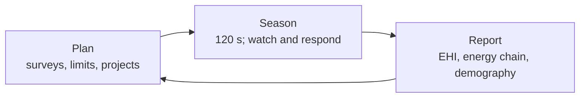
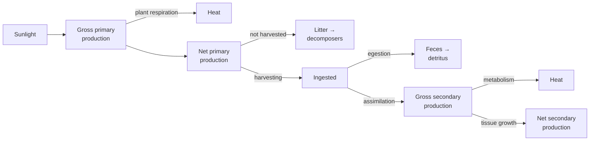
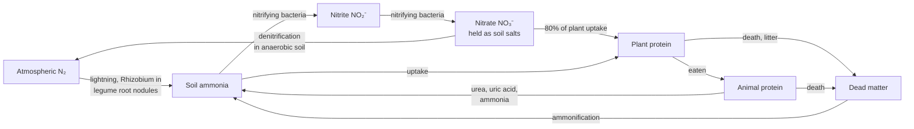
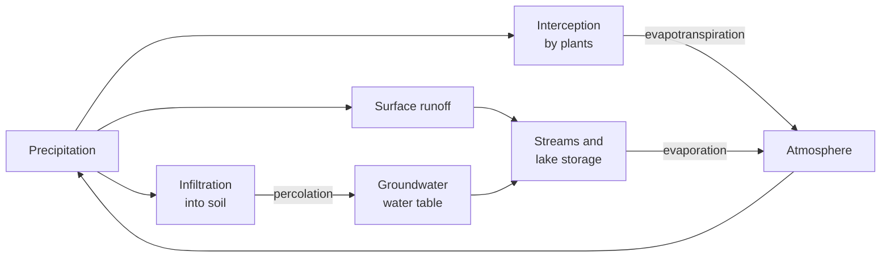
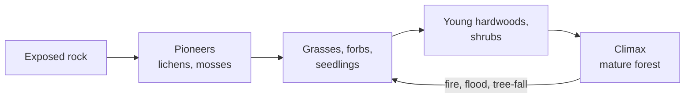

# Trophic — Phase 3 Design: Textbook Energy Flow

Sep 23, 2026 · @Matt

## Overview

Phase 3 rebuilds Trophic's energy model around the textbook's chain of named efficiencies. That chain runs from GPP to NPP, then harvesting, assimilation and tissue growth. On top of it, Phase 3 adds a nitrogen cycle, population accounting, species interactions and succession, so the game teaches the same concepts, with the same terms and numbers, as the Unit 5 Ecological Concepts chapter (pp. 187–213).

**Where Phase 2 diverges from the text**

| Topic            | Textbook                                                                         | Phase 2 build                                             |
| ---------------- | -------------------------------------------------------------------------------- | --------------------------------------------------------- |
| Energy transfer  | Five separate steps: GPP → NPP → harvest → assimilation → tissue growth          | Two numbers per meal, A × P; harvesting isn't modeled     |
| Endotherm growth | Tissue growth efficiency 1–3%                                                    | P about 0.25–0.30, with no endotherm penalty (tuned to 0) |
| Pyramids         | Numbers, biomass and energy are different pictures, and the first two can invert | One pyramid, of EU per tick                               |
| Nutrients        | Carbon and nitrogen cycles, with decomposers closing the loop                    | One abstract soil-nutrient value per tile                 |
| Populations      | N(t+1) = N + B + I − D − E; exponential vs logistic growth; carrying capacity K  | Births and deaths are counted; K never appears            |
| Interactions     | Seven interaction types, competitive exclusion, keystone species                 | Predation plus implicit competition                       |
| Change over time | Primary and secondary succession, light gaps                                     | Producer types never change on a tile                     |

**Phase 3 pillars**

- **The player is the ecosystem's steward, not one of its species.** Success means keeping the whole community in balance, not dominating it (see Player role).
- **Every percentage has a name.** Each loss in the energy chain is a labeled efficiency that the player can read and compare against the textbook range.
- **Three pyramids, one truth.** Numbers, biomass and energy are all shown. Only the energy pyramid must always narrow at each level; the other two can invert, as the text explains.
- **Energy flows, nutrients cycle.** Energy leaves as heat. Nitrogen returns to the soil only through decomposers and bacteria, and it limits plant growth.
- **Populations follow the textbook equation.** The round report shows B, I, D and E, the growth rate r, and each species' carrying capacity K.
- **Game mode and Realism mode.** Game mode keeps the scaled efficiencies. Realism mode uses the textbook's ranges for classroom use, which answers an open question from the original game design doc.

## Player role: ecosystem steward

In Phase 3 the player no longer controls one species. They manage the whole ecosystem as its steward, and the goal is to keep nature's balance through 30 rounds of droughts, invasions and demands for timber and game. This follows the textbook's point that wildlife managers "manage habitat as much as, or more than, they do wildlife" (p. 205).

**What changes from Phases 1–2**

| Phase 1–2                                            | Phase 3                                                                                                                                                                                   |
| ---------------------------------------------------- | ----------------------------------------------------------------------------------------------------------------------------------------------------------------------------------------- |
| You are one lineage competing to dominate            | You look after every species, and no species is "yours"                                                                                                                                   |
| Win by defeating rivals or holding 35–50% of biomass | Win by keeping the **Ecosystem Health Index** high and meeting the scenario's restoration goals                                                                                           |
| Mutation Points buy genes                            | **Stewardship Points (SP)** fund management actions                                                                                                                                       |
| Directives steer your species                        | Management actions change habitat, harvest and species presence                                                                                                                           |
| Species evolve and split into new species            | No evolution. Each round is one year, far too short for appreciable evolutionary change, so every species keeps fixed traits. The steward changes which species thrive, not what they are |

### Ecosystem Health Index

The Ecosystem Health Index (EHI) is a 0–100 score built from the concepts in this document. Each component maps to a textbook idea, so improving the score means applying the ecology correctly.

| Component                          | Weight | Healthy when                                                                                                                                                               | Textbook basis                                   |
| ---------------------------------- | ------ | -------------------------------------------------------------------------------------------------------------------------------------------------------------------------- | ------------------------------------------------ |
| Energy pyramid integrity           | 20     | 3–5 levels present; transfer per level within the mode's band; the energy pyramid narrows at every level                                                                   | Energy flow, 10% rule                            |
| Biodiversity                       | 20     | Species richness and Shannon diversity at or above the scenario's baseline; no unnecessary extinctions                                                                     | Species diversity, extinction rates              |
| Population stability               | 15     | Most species between ½K and K, with no boom–bust swings over 3×                                                                                                            | Carrying capacity, logistic growth               |
| Nutrient, water and carbon balance | 15     | Soil nitrogen within band; denitrification and runoff losses below fixation; groundwater withdrawal no greater than recharge; carbon balance at or below zero (a net sink) | Nitrogen, hydrologic and carbon cycles           |
| Keystone and mutualist presence    | 10     | Every species flagged Keystone, and every obligate partner, still present                                                                                                  | Keystone species, cascades                       |
| Habitat structure                  | 10     | A mosaic of seral stages; interior habitat not fragmented below the scenario minimum                                                                                       | Succession, edge effects                         |
| Small-population viability         | 10     | Every species at or above its minimum viable population: enough breeding adults, in connected habitat, to ride out a bad year; isolated remnants are flagged               | Allee effects, fragmentation, endangered species |

The report shows each component's change and its main cause, for example: "Population stability −6: Grazelings overshot K by 2.4× after the Stalker decline."

### Management actions

The steward acts indirectly, as real managers do, through habitat, harvest limits and species presence. They never control an animal directly. Each action costs SP, and many take effect over several rounds.

| Category  | Action                | Effect                                                                                                                                                                                                              | Ecology it teaches                     |
| --------- | --------------------- | ------------------------------------------------------------------------------------------------------------------------------------------------------------------------------------------------------------------- | -------------------------------------- |
| Monitor   | Population survey     | Reveals a species' estimated N and K with error bars (numbers are hidden or fuzzy until surveyed)                                                                                                                   | Managers track rates, not exact counts |
| Monitor   | Soil test             | Reveals nitrogen pools and soil moisture on an area                                                                                                                                                                 | Nutrient limitation                    |
| Monitor   | Vegetation transect   | Reveals native vs non-native cover and the seed bank's make-up along a line of tiles                                                                                                                                | Monitoring restoration                 |
| Monitor   | Well gauge            | Reveals the water table and this round's recharge vs withdrawal                                                                                                                                                     | Groundwater, aquifers                  |
| Monitor   | Radio collar          | Tracks one individual's range, diet and fate                                                                                                                                                                        | Home ranges                            |
| Habitat   | Prescribed burn       | Resets a patch to the grasses stage; clears litter; restarts secondary succession (and releases its carbon). Burned in the right season, it sets back cool-season non-native grasses and favors warm-season natives | Succession, fire ecology               |
| Habitat   | Shred (mow)           | Cuts a patch's standing growth before seed set, cutting the non-natives' seed rain; no bare soil, but it needs repeating over several rounds                                                                        | Seed banks, disturbance                |
| Habitat   | Disc                  | Turns the sod and kills roots, removing an established non-native stand at once; leaves bare soil open to runoff and releases a nitrogen flush; the seed bank recolonizes it unless it's overseeded                 | Disturbance, erosion                   |
| Habitat   | Overseed natives      | Adds native grass and forb seed to a patch's seed bank; most effective in the round after a burn, shred or disc                                                                                                     | Competition, restoration               |
| Habitat   | Plant natives         | Seeds a chosen producer on bare or disturbed tiles                                                                                                                                                                  | Restoration                            |
| Habitat   | Plant legumes         | Seeds a nitrogen-fixing cover crop that adds soil nitrogen through root nodules                                                                                                                                     | Symbiotic nitrogen fixation            |
| Habitat   | Restore wetland       | Raises moisture on low tiles; boosts denitrification, carbon storage and wetland strata                                                                                                                             | Hydrarch habitats, nitrogen loss       |
| Habitat   | Riparian buffer       | Plants a vegetated strip along a stream so it catches runoff and the nitrate it carries                                                                                                                             | Runoff, leaching                       |
| Habitat   | Loosen compacted soil | Ends compaction on a patch, so rain infiltrates and nitrification resumes                                                                                                                                           | Infiltration, denitrification          |
| Habitat   | Reforest              | Plants woody producers on a patch; a slow but lasting carbon sink                                                                                                                                                   | Carbon storage                         |
| Habitat   | Assisted migration    | Plants a heat-tolerant producer ahead of a shifting climate envelope                                                                                                                                                | Climate change, migration rates        |
| Habitat   | Wildlife corridor     | Links fragments so interior species can cross, isolated populations can rejoin, and ranges can follow a warming climate                                                                                             | Fragmentation, edge effects            |
| Habitat   | Grazing exclosure     | Fences a patch against herbivores for 3 rounds                                                                                                                                                                      | Harvesting efficiency, recovery        |
| Wildlife  | Harvest limit         | Sets a bag limit per species (0 to ½K per round); earns SP from sustainable yield                                                                                                                                   | Optimal yield at ½K                    |
| Wildlife  | Reintroduction        | Releases a group from the regional pool (for example, returning an apex predator)                                                                                                                                   | Keystone predators, trophic cascades   |
| Wildlife  | Translocation         | Brings in individuals of a present species from elsewhere to bolster a small, isolated population                                                                                                                   | Minimum viable populations             |
| Wildlife  | Invasive control      | Removes a share of an invasive species per round; costly and slow                                                                                                                                                   | Invasive species                       |
| Wildlife  | Protect species       | Bans harvest and reduces disturbance around an endangered species' habitat                                                                                                                                          | Endangered species                     |
| Community | Water allocation      | Caps irrigation withdrawal from groundwater; lowers trust with farming demands                                                                                                                                      | Aquifer overdraw                       |

#### Non-native grasses and seed banks

Many ranches and old fields were planted with non-native forage grasses (in the U.S., species such as tall fescue, smooth brome or bermudagrass) because they feed cattle well. Left alone, they form dense single-species sods that shade out native grasses and forbs. Phase 3 models them as producers flagged **non-native**:

- **Traits:** fast growth, high grazing tolerance and a thick sod that suppresses seedlings under them (amensalism). They're poor food and cover for most native consumers, so native herbivores and pollinators harvest little from them.
- **Monocultures:** a patch where one non-native grass covers most tiles counts against the Biodiversity and Habitat structure components of the EHI.
- **Seed banks:** every tile keeps a seed bank recording its native and non-native shares. When a tile is cleared by a burn, shred, disc or heavy grazing, it recolonizes from its seed bank and its neighbors' seed rain. Removing a non-native stand without adding native seed usually lets the non-native grass come straight back.
- **Competition after removal:** once a tile is cleared, native seedlings establish in proportion to their share of the seed bank, adjusted for conditions. Non-natives win on nitrogen-rich, heavily grazed ground. Natives win on low-nitrogen soil, after well-timed fire and in drought. Overseeding raises the native share so natives can out-compete the non-natives before they re-form a sod.
- **Trade-offs:** each removal method has a cost. Burning is cheap but seasonal and releases carbon. Shredding is gentle but slow. Discing is fast, but it exposes soil to runoff for a round and releases a nitrogen flush that feeds non-native regrowth. A typical restoration sequence is remove, overseed, then rest the patch (with an exclosure) while the natives establish.

### What the steward knows

The steward starts almost blind. At the start of a scenario the steward has only coarse impressions from incidental sightings, and many species aren't known to exist at all. Surveys reveal more over time, and what they reveal goes stale if monitoring lapses. The game follows real managers, who work from estimates rather than counts.

| Knowledge level | How it's reached                                                                                                                                                          | What the steward sees                                                                                                                                                                                       |
| --------------- | ------------------------------------------------------------------------------------------------------------------------------------------------------------------------- | ----------------------------------------------------------------------------------------------------------------------------------------------------------------------------------------------------------- |
| Unknown         | The starting state for most species                                                                                                                                       | Nothing: the species doesn't appear in the Codex, watch list or pyramids, though it still eats, is eaten and cycles nutrients. Small, nocturnal, cryptic, rare and soil-dwelling species usually start here |
| Sighted         | Incidental sightings during play, whose chance each round scales with abundance × conspicuousness (body size, day activity, open habitat), plus reports from stakeholders | Name, trophic level and a sketch; abundance as a coarse word (rare, uncommon, common, abundant); dots where sightings happened                                                                              |
| Surveyed        | A survey method that suits the species (below)                                                                                                                            | An estimate of N with an error bar, a range map and the trend since the last survey                                                                                                                         |
| Studied         | Surveys repeated over 3 or more rounds, or a radio collar                                                                                                                 | An estimate of K, diet and interactions, age pyramid, measured efficiencies and the demography equation terms                                                                                               |

**Survey methods** each cost SP, cover a painted area, and have a detection probability per species. Accuracy improves with effort and repeat visits:

- **Point counts and transects:** birds, large mammals, producers.
- **Camera traps:** nocturnal and cryptic mammals.
- **Live traps and mist nets:** small mammals, bats, songbirds.
- **Pitfall traps and soil cores:** invertebrates and decomposers.
- **Vegetation transects:** native vs non-native cover and seed banks.
- **Dip nets and water sampling:** aquatic species and plankton.

**Staleness:** every estimate records the year it was measured. Without new data, error bars widen about 15% of N per round, and trend arrows fade after 2 rounds. After 5 rounds a Surveyed species drops back to Sighted detail, and its last estimate is kept but marked stale. A standing monitoring program (repeat surveys on a schedule) costs SP upkeep every round.

**The previous steward's records:** each scenario starts with a few species at Surveyed level, typically 5–10 that the scenario names as key (the dominant grass, the livestock, the at-risk species). The records are reliable: each estimate was accurate when it was taken. But they are dated 1–5 years before the start, so staleness already applies, and populations may have moved since.

**Effects on play:**

- The HUD shows the EHI as a range built from what the steward knows, and a component the steward knows nothing about shows its full possible range. The true EHI appears in the final report and is the one used for scoring.
- Harvest limits are set against estimated N, so managing from stale data risks overharvest.
- Discovering a species (Unknown to Sighted) earns SP, and more trust with research and conservation stakeholders if the species is at risk.

### Stakeholders

Community demands come from several **stakeholders** with competing asks, not from one town. At world generation the generator draws 3–6 stakeholders from the types below, weighted by ecoregion and scenario. A scenario can require a type (Rewilding the ranch always has a ranching family), and the rest are random.

| Stakeholder type               | Typical asks                                                     | Likes                                                          | Dislikes                                         |
| ------------------------------ | ---------------------------------------------------------------- | -------------------------------------------------------------- | ------------------------------------------------ |
| Rancher or grazing association | Forage for a cattle stocking quota; predator control             | Grazing leases, stock water                                    | Apex predator return, exclosures, stocking cuts  |
| Farmer or irrigator            | Irrigation water; pollination; pest control                      | Generous water allocation, pollinator habitat                  | Allocation caps, wetland restoration on cropland |
| Timber company                 | A timber quota from woody producers                              | Harvesting mature stands                                       | Protected interior forest, reserves              |
| Hunters and anglers            | A game quota; healthy game herds                                 | Harvest limits set near ½K, habitat projects                   | Harvest bans; some dislike predator return       |
| Conservation group             | Protection for an at-risk species; native cover; reintroductions | Protect species, corridors, reintroduction, non-native removal | High harvests, extinctions, non-native spread    |
| Outfitters and tourism         | Sightings of charismatic species; intact scenery                 | Apex predators, wetlands, bird diversity                       | Clearcuts, discing, burns in the visitor season  |
| Town water utility             | Steady stream flow with low nitrate                              | Riparian buffers, wetlands, groundwater recharge               | Runoff, aquifer overdraw                         |
| Beekeepers and orchardists     | Flowering producers and healthy pollinators                      | Native forbs, legumes                                          | Grass monocultures, pollinator decline           |
| Traditional land users         | Culturally important species and gathering areas                 | Native species reintroduction, cultural burning                | Loss of culturally important species             |
| Research station               | Survey data on a focus species                                   | Surveys, radio collars, long-term plots                        | Lapsed monitoring, loss of study species         |

**Generation:** each stakeholder rolls how much they want, how flexible they are (how many refused asks they tolerate) and an **influence** weight. Their asks attach to the real species drawn for this world. The hunters want *this* world's large grazer, and the conservation group champions one of *this* world's at-risk species, possibly one the steward hasn't discovered yet.

**Competing asks:** each round, 1–3 asks arrive from different stakeholders, and a conflict table marks which asks and actions please one stakeholder while upsetting another. Meeting an ask earns SP and trust with whoever made it. Refusing costs trust.

**Arrivals and departures:** a world generation option, **Changing community**, which is on by default.

- Each round there is a small chance that a stakeholder leaves (a ranch is sold, a mill closes) or a new one arrives (an outfitter opens, a subdivision forms a homeowners' association).
- Events make changes more likely: a drought can ruin a ranch, and a returning wolf pack can draw tourism.
- Newcomers start with neutral trust. A stakeholder who leaves stops counting toward the mandate.
- The land a departing stakeholder held can change use. Depending on the mandate at that moment, a sold ranch might become a subdivision or a conservation easement.

**Land sales:** when a departing stakeholder's land goes up for sale, the steward has one round to bid SP for a **conservation easement**.

- The price scales with the parcel's size and the demand from other buyers.
- Allies (trust above 70) can contribute to the purchase, which lowers the price.
- A successful bid protects the parcel from development and opens it to management actions.
- If the steward doesn't bid, or is outbid, the new use is rolled at random, weighted by biome and mandate: a subdivision, another ranch, cropland, a hunting lease or a private conservation buyer. The new owner may bring a new stakeholder with them.

With the option off, the starting stakeholders stay for the whole scenario.

**Trust and mandate:**

- Each stakeholder has trust from 0 to 100.
- The steward's **mandate** is the influence-weighted average of all stakeholders' trust.
- Allies (trust above 70) lower the cost of actions they like, for example with volunteer crews and donated land.
- Opponents (trust below 30) raise the cost of actions they dislike through lobbying and lawsuits.

The core tension remains: take too little and you can't fund conservation, take too much and the pyramid collapses. But now "too much" depends on who is asking.

### Round loop



- **Plan:** spend SP on surveys and projects, set harvest limits, and accept or decline community demands.
- **Season:** the simulation runs. The steward can make a few rapid responses at limited cost, such as an emergency survey or fire suppression.
- **Report:** the Phase 2 selection report is reframed around the whole ecosystem: EHI, the energy chain, demography for every species, and a "what changed and why" list.

### Scenarios

Each run is a scenario set in one real ecoregion, with a starting world and restoration goals drawn from the textbook's examples. A scenario defines **niche slots**, not species. Every new world fills those slots with real species drawn from the ecoregion's catalog (see Real species by ecoregion below), so the same scenario plays out with a different cast each time.

| Scenario              | Ecoregion (Level II)                                                        | Start                                                                                                                                                                                                                                                                                                                          | Goal by round 30                                                                                                                                                                                                                                                                                                                                                                             |
| --------------------- | --------------------------------------------------------------------------- | ------------------------------------------------------------------------------------------------------------------------------------------------------------------------------------------------------------------------------------------------------------------------------------------------------------------------------ | -------------------------------------------------------------------------------------------------------------------------------------------------------------------------------------------------------------------------------------------------------------------------------------------------------------------------------------------------------------------------------------------- |
| Old-field restoration | 9.2 Temperate Prairies (Iowa and Illinois prairie)                          | Abandoned cropland, mostly bare with a seed bank                                                                                                                                                                                                                                                                               | Reach a tallgrass prairie climax with 4 or more trophic levels                                                                                                                                                                                                                                                                                                                               |
| Predator return       | 6.2 Western Cordillera (Greater Yellowstone)                                | Streamside willow and aspen overbrowsed by abundant elk, with no apex predator                                                                                                                                                                                                                                                 | Reintroduce an apex predator and see a trophic cascade restore the producers                                                                                                                                                                                                                                                                                                                 |
| Rewilding the ranch   | 9.3 West-Central Semiarid Prairies (northeastern Montana)                   | A cattle ranch stocked above K for decades: trampled, compacted soil that sheds rain as runoff, gullies cutting the slopes, pastures planted with non-native forage grasses that have formed monocultures with seed banks full of their seed, cattle as nearly the only large herbivore, and native grazers and predators gone | Phase cattle down with harvest limits and exclosures, loosen soil so rain soaks in again, remove non-native grass stands (by burning, shredding or discing) and overseed natives until native cover exceeds 60%, reintroduce native grazers and then an apex predator, and reach 4 or more trophic levels with a mid-seral native grassland mosaic, while the mandate stays at 50% or higher |
| Invasive outbreak     | 15.4 Everglades                                                             | A generalist invader drawn from the catalog's non-native species, spreading from one corner                                                                                                                                                                                                                                    | Hold native richness at baseline while the invader declines                                                                                                                                                                                                                                                                                                                                  |
| Endangered songbird   | 9.4 South Central Semiarid Prairies (Edwards Plateau, Texas Hill Country)   | A fragmented juniper–oak woodland with an endangered interior-nesting songbird and a nest parasite                                                                                                                                                                                                                             | Grow the songbird to a self-sustaining population by adding corridors and interior habitat                                                                                                                                                                                                                                                                                                   |
| Volcanic island       | Hawaiʻi (outside the Level II set; see below)                               | A fresh lava flow (primary succession)                                                                                                                                                                                                                                                                                         | Build a stable native community from pioneers upward while keeping non-native arrivals in check                                                                                                                                                                                                                                                                                              |
| Dry plains aquifer    | 9.4 South Central Semiarid Prairies (High Plains over the Ogallala Aquifer) | Irrigated prairie over a falling water table, with compacted, nitrate-leaching fields                                                                                                                                                                                                                                          | Bring withdrawal down to recharge and stop nitrate runoff into the stream while keeping the mandate                                                                                                                                                                                                                                                                                          |
| Warming world         | 8.4 Ozark, Ouachita-Appalachian Forests (Central Appalachians)              | A temperate hardwood forest under rising CO₂ and a climate envelope moving north each round                                                                                                                                                                                                                                    | Keep forest cover and richness at 80% of baseline and the map a net carbon sink                                                                                                                                                                                                                                                                                                              |
| Sandbox               | Any of the 25 Level II ecoregions in the continental U.S.                   | A random draw of that ecoregion's species                                                                                                                                                                                                                                                                                      | No goals; watch EHI and experiment                                                                                                                                                                                                                                                                                                                                                           |

### Real species by ecoregion

Every species in the game is a real species with its real common and scientific names. Species are grouped by **ecoregion**. Land uses the CEC North American ecoregions at **Level II**, as mapped by the EPA, and launch ships all 25 Level II ecoregions in the continental U.S. Each catalog covers only its ecoregion's continental U.S. extent. A scenario names its Level II ecoregion and a real place within it (Greater Yellowstone, the Edwards Plateau) that sets its starting map. Water uses Marine Ecoregions of the World.

The Volcanic island scenario is set in Hawaiʻi, which lies outside the continental Level II set, so it ships with its own Hawaiʻi catalog built with the same tool. The other seven scenarios share six Level II ecoregions (the Edwards Plateau and the High Plains both sit in 9.4 South Central Semiarid Prairies), and Sandbox adds the remaining 19.

Each ecoregion has a **species catalog** of the species recorded there. Every entry has its traits, native or non-native status and conservation status. Every scenario is set in one ecoregion and lists its community as niche slots. Each slot gives a role, a trophic level, a count range and constraints. At each world generation the game fills the slots with a fresh random draw from that ecoregion's catalog.

Two playthroughs of Rewilding the ranch share the same problems (a crested wheatgrass monoculture, compacted soil, a missing apex predator) but not the same cast. One run's apex predator slot might be filled by the gray wolf, the next by the mountain lion.

Slots name a role, never an exact species or archetype. Any catalog species that fits the role and meets the constraints can fill a slot. In the West-Central Semiarid Prairies, one "mesopredator" slot might become a coyote, a red fox, an American badger or a swift fox. Example slot list for Rewilding the ranch (West-Central Semiarid Prairies). The candidate lists are illustrative; the shipped catalog is checked against occurrence records:

| Slot                       | Count | Constraints                                                            | Candidate species                                                                                                                                                                                                                       |
| -------------------------- | ----- | ---------------------------------------------------------------------- | --------------------------------------------------------------------------------------------------------------------------------------------------------------------------------------------------------------------------------------- |
| Non-native forage grasses  | 1–2   | Non-native, sod-forming, grazing-tolerant, cool-season; start dominant | Crested wheatgrass (*Agropyron cristatum*), smooth brome (*Bromus inermis*), Kentucky bluegrass (*Poa pratensis*)                                                                                                                       |
| Native grasses             | 3–6   | Native, fire-tolerant; start mostly in the seed bank                   | Western wheatgrass (*Pascopyrum smithii*), needle-and-thread (*Hesperostipa comata*), blue grama (*Bouteloua gracilis*), green needlegrass (*Nassella viridula*), prairie sandreed (*Calamovilfa longifolia*)                           |
| Native forbs and legumes   | 4–10  | At least 1 nitrogen fixer and 2 pollinator-dependent species           | Purple prairie clover (*Dalea purpurea*), American vetch (*Vicia americana*), scarlet globemallow (*Sphaeralcea coccinea*), prairie coneflower (*Ratibida columnifera*), fringed sage (*Artemisia frigida*)                             |
| Domestic livestock         | 1     | Managed by the rancher stakeholder                                     | Cattle (*Bos taurus*), always                                                                                                                                                                                                           |
| Native large grazers       | 1–2   | In the regional pool only at start                                     | American bison (*Bison bison*), pronghorn (*Antilocapra americana*), elk (*Cervus canadensis*)                                                                                                                                          |
| Small herbivores           | 6–15  | Rodents, hares and insects                                             | Black-tailed prairie dog (*Cynomys ludovicianus*), white-tailed jackrabbit (*Lepus townsendii*), deer mouse (*Peromyscus maniculatus*), thirteen-lined ground squirrel (*Ictidomys tridecemlineatus*), grasshoppers (*Melanoplus* spp.) |
| Pollinators                | 4–10  | At least 1 specialist tied to one forb                                 | Hunt's bumble bee (*Bombus huntii*), leafcutter bees (*Megachile* spp.), sweat bees (Halictidae), painted lady (*Vanessa cardui*)                                                                                                       |
| Grassland birds            | 5–12  | At least 1 area-sensitive species; 1 nest parasite                     | Sprague's pipit (*Anthus spragueii*), chestnut-collared longspur (*Calcarius ornatus*), grasshopper sparrow (*Ammodramus savannarum*), western meadowlark (*Sturnella neglecta*), brown-headed cowbird (*Molothrus ater*)               |
| Raptors                    | 2–4   | At least 1 ground nester                                               | Ferruginous hawk (*Buteo regalis*), golden eagle (*Aquila chrysaetos*), burrowing owl (*Athene cunicularia*)                                                                                                                            |
| Mesopredators              | 2–4   | Mixed diets; released when the apex predator is absent                 | Coyote (*Canis latrans*), red fox (*Vulpes vulpes*), American badger (*Taxidea taxus*), swift fox (*Vulpes velox*), black-footed ferret (*Mustela nigripes*, regional pool only)                                                        |
| Apex predator              | 1     | In the regional pool only at start                                     | Gray wolf (*Canis lupus*), mountain lion (*Puma concolor*)                                                                                                                                                                              |
| Scavengers and decomposers | 4–8   | Including a dung-burying guild                                         | Common raven (*Corvus corax*), turkey vulture (*Cathartes aura*), dung beetles (*Onthophagus* spp.), burying beetles (*Nicrophorus* spp.), soil fungi and bacteria (as guilds)                                                          |

**Scale:** each ecoregion catalog holds about 150–400 species. A world draws 60–150 of them onto the map, plus 20–40 into the regional pool. The pool draws from the same ecoregion and its neighbors. Most species are small and numerous (insects, soil fauna, forbs), and many start Unknown.

**How a species is placed:**

1. The slot's constraints filter the ecoregion catalog to candidates by role, trophic level, habitat, native status and conservation status.
2. A candidate is drawn at random, weighted by its real regional abundance. Common species are drawn often, rare ones occasionally.
3. Its traits come from the catalog's real data: body mass, diet, endotherm or ectotherm, activity time, lifespan, litter or clutch size and stratum. These are mapped onto the game's ranges, then scaled by Game or Realism mode.
4. Its sprite comes from its taxon group's template, with programmatic tweaks that make the species unique (see Species sprites below).
5. Its Codex entry shows the common and scientific names, conservation status, native or non-native status and a short description. Food web links come from the catalog's diet data, filtered to the species present in this world.

The stability test then runs. A slot that fails is redrawn with a different candidate species instead of redrawing the whole cast.

**Two-tier simulation:** simulating 100+ species as individuals would blow the tick budget.

- Vertebrates and other large animals stay individual-based (about 400–800 individuals).
- Plants, insects, soil fauna, decomposers and plankton are abstracted into **Populations** (below), updated every 10 ticks with the same energy, nutrient and demography equations.

#### Populations

A **Population** is one species' group living in one connected region. It isn't a set of individuals and can't be split into them.

- **Region:** the set of tiles the Population occupies, drawn on the map as a smooth outline of arbitrary shape and shaded by density. Its state is its size N (or biomass), its age classes, and its density on each tile of the region.
- **Growth and spread:** where density nears the local carrying capacity, the region spreads into neighboring suitable tiles. Where density falls to zero, the region shrinks. Fire, discing, drought and flooding cut holes in it.
- **Split:** after each update a connectivity check (flood fill) runs on each region. If a region breaks into disconnected parts, for example because a disc strip cuts a meadow in two, the Population becomes two Populations. Each keeps the share of N living in its part, gets its own place-based label ("North meadow", "Creek bottom"), and inherits a copy of the survey record.
- **Merge:** when two Populations of the same species come to touch, they become one Population. This happens when regrowth closes a gap or a corridor links them. Their N and age classes add together, and the survey record keeps the more recent estimate.
- **Selection and close-up:** clicking a region selects the Population. The inspector shows estimated N, area, density, trend and which Populations it split from or merged with. The close-up view scatters representative sprites by density for flavor, but they can't be selected.
- **Surveys and viability:** knowledge levels, staleness and the small-population viability check apply to each Population. A species split into small, isolated Populations is flagged even when its total N looks healthy. The Codex lists each species with its current Populations.

**Large animals get Populations too.** Vertebrates are still simulated as individuals, but each herd, pack or flock also has a Population region for display, surveys and viability checks. The region is the combined home ranges of the group's members, recomputed each round. When a group divides, its Population splits, and when groups join, their Populations merge, just as they do for small taxa. Survey knowledge and staleness attach to these Populations. A radio collar still follows one individual, and the inspector lets the steward open a Population's member list.

Populations appear as region outlines on the map and as counts in the pyramids and the Codex.

**Seeds:** the world seed is shown and can be shared. The same scenario with the same seed produces the same world, so a class can all play the same cast.

**Catalog data:** catalogs are built offline from openly licensed datasets, for example:

- GBIF occurrence records for which species live in each ecoregion.
- EltonTraits for diet and body mass.
- USDA PLANTS and regional floras for plants.
- IUCN and national lists for conservation status.

They ship as static script files, so the game still runs from `file://`, and the credits screen attributes every source and illustrator.

#### Species sprites

Each taxon group (bovid, canid, felid, songbird, raptor, bee, beetle, grass, forb, tree and so on) has one hand-drawn **template**. The template is built as separate layered parts (body, head, legs, tail, wings, and markings such as stripes, spots or a mask), with anchor points where parts attach and regions that can be recolored.

Every species in the group renders from that template with **programmatic tweaks**, taken from its catalog entry so the same species always looks the same:

- **Proportions:** overall size from body mass; leg, neck, tail, ear, bill or stem length and body depth scaled per species.
- **Parts:** variant parts swapped in where the group has them, such as horns or antlers, crest, tail shape, leaf shape or flower head.
- **Color and pattern:** each recolorable region tinted from the catalog's colors, and markings switched on, off or resized.
- **Pose and scale:** a stance and an on-map size that fit the species' size class.

Every rendered species gets its own tweak set, including the small taxa scattered in Population close-ups. Guilds that are never drawn, such as soil fungi and bacteria, have none. Tweak sets are data in the species catalog, so adding a species needs no new art unless its taxon group has no template yet.

A build check renders every catalog and flags any two species in the same catalog whose sprites are too similar to tell apart, most importantly candidates for the same slot (a coyote, red fox and swift fox must read as three different animals). A flagged pair gets adjusted tweaks before the catalog ships. Rendered sprites are cached per species, so the tweaks cost nothing per tick. Traits are real, but behavior in the simulation is simplified, and each Codex entry says so.

### Win, lose and score

- **Win:** finish the scenario's rounds with average EHI ≥ 70 and every restoration goal met.
- **Lose, ecosystem collapse:** EHI below 30 for 2 rounds, or producer biomass below 15% of the start (the collapse rule from the original game design doc).
- **Lose, mandate:** the steward's mandate (stakeholder trust weighted by influence) falls to 0 after repeatedly refusing asks or letting harvests fail, and the steward is replaced.
- **Score:** average EHI × rounds survived, plus bonuses for species recovered and species reintroduced, minus avoidable extinctions.

### What Phase 3 retires from Phase 2

- **Genomes, inheritance and speciation are removed.** Phase 3 is a present-day management sim in which one round is one year, and a 30-year scenario is far too short for appreciable evolution. Each species has a fixed trait sheet: real values from the ecoregion's species catalog (body mass, diet, metabolism and so on), mapped onto game ranges. Individuals differ only in age, sex, body condition and position, none of which is inherited.
- **Evolution screens and tools are removed:** the Species editor, Evolve screen, mutation cards, Champion, Cull, directives, the Phylogeny screen, the "What evolved" report, and lineage splits with their daughter species. The Codex keeps each species' fixed traits and its population history.
- **No Lineage mode.** The Phase 2 single-species game is retired rather than kept as an optional mode.
- **Code impact:** `genes.js` and `evolution.js` are retired, and per-individual genomes give way to one derived stat block per species. Saves move to v3, and a Phase 2 save migrates by averaging each species' genomes into its trait sheet.

## Energy flow chain

Energy moves through five named steps at each trophic level. The simulation books every unit of energy against one of them, so the report can reproduce the textbook's "packet of energy" walk-through, which starts from 100,000 units of GPP.



NSP is the new tissue that the next level can harvest, and the chain repeats from the harvesting step.

### The textbook's worked example, as a test case

| Step                           | Textbook value (p. 192–193)             | Efficiency used             |
| ------------------------------ | --------------------------------------- | --------------------------- |
| Gross primary production       | 100,000 units/day                       | —                           |
| Net primary production         | 50,000                                  | NPP efficiency 50%          |
| Ingested by herbivores         | 10,000                                  | Harvesting efficiency 20%   |
| Assimilated (GSP)              | 3,000–6,000                             | Assimilation 30–60%         |
| Herbivore tissue (NSP)         | 1,000–2,500 ectotherm; 50–150 endotherm | Tissue growth 20–50% / 1–3% |
| Ingested by primary carnivores | 2,000                                   | Most herbivores eaten       |
| Assimilated by carnivores      | 1,800                                   | Assimilation 90%            |
| Carnivore tissue               | 360–900 ectotherm; 18–54 endotherm      | Tissue growth 20–50% / 1–3% |

`tools/check-energy.js` (new) runs a closed three-level world with these efficiencies fixed. It must reproduce every row within ±10%, so the textbook numbers become a regression test.

### How each step maps to the simulation

| Step              | Phase 2                                                            | Phase 3 change                                                                                                                                                       |
| ----------------- | ------------------------------------------------------------------ | -------------------------------------------------------------------------------------------------------------------------------------------------------------------- |
| GPP               | Light × C\_photo, folded into storage                              | Booked separately per tile and per producer species                                                                                                                  |
| Plant respiration | Fixed R\_plant = 0.50                                              | Per-producer trait, 0.20–0.75 (the textbook's 20–75% range); fast growers respire more                                                                               |
| NPP not harvested | Stays on the tile until the tile's cap stops growth                | **New litterfall:** standing crop above a producer's steady-state cap drops as litter into detritus, so uneaten NPP feeds decomposers as in the text                 |
| Harvesting        | Not modeled; emerges from grazing                                  | Measured each round as ingested ÷ NPP and shown per level; plant toughness and cover lower it                                                                        |
| Egestion          | 1 − A of each meal to detritus                                     | Unchanged, but reported as "egestion"                                                                                                                                |
| Assimilation      | A from the diet curve                                              | Kept; ranges re-anchored to the textbook (next section)                                                                                                              |
| Tissue growth     | A per-meal P plus separate upkeep, which double-counts respiration | **Per-meal P is removed.** All respiration is upkeep (basal + activity + thermoregulation). Tissue growth efficiency is then *measured* as NSP ÷ GSP rather than set |

Removing the per-meal P is the key change. The textbook defines tissue growth efficiency as what remains after metabolism, so metabolism has to be the only sink. Endotherms get a thermoregulation upkeep term, colder in winter and scaled by the biome, which produces their low efficiency naturally.

## Ecological efficiencies

Every efficiency gets a textbook range and two settings. **Game mode** stays close to the textbook but keeps endotherm predators viable on a 64 × 64 map. **Realism mode** uses the textbook's ranges exactly.

| Efficiency                                   | Textbook range | Phase 2 value            | Phase 3 game mode                                | Phase 3 realism mode                                          |
| -------------------------------------------- | -------------- | ------------------------ | ------------------------------------------------ | ------------------------------------------------------------- |
| Photosynthetic capture of sunlight           | < 1%           | 20% (C\_photo)           | 20%                                              | 1%, with sunlight per tile × 20 so absolute EU stays workable |
| NPP efficiency (NPP ÷ GPP)                   | 25–80%         | 50% fixed                | 25–80%, per-producer respiration trait           | 25–80%                                                        |
| Harvesting efficiency (grassland herbivores) | 5–30%          | Not measured             | Measured; target 10–30%                          | Measured; target 5–30%                                        |
| Herbivore assimilation                       | 30–60%         | 50%                      | 30–60%, set by each species' plant-gut trait     | 30–60%                                                        |
| Carnivore assimilation                       | 60–90%         | 80%                      | 60–90%, set by each species' meat-gut trait      | 60–90%                                                        |
| Tissue growth, ectotherm                     | 20–50%         | Emerges from P 0.23–0.38 | 20–50%, emergent                                 | 20–50%, emergent                                              |
| Tissue growth, endotherm                     | 1–3%           | Emerges from P 0.15–0.30 | 6–12%, emergent (thermoregulation scaled × 0.35) | 1–3%, emergent                                                |
| Transfer per level (the "10% rule")          | About 10%      | 12–18%                   | 8–15%                                            | 0.05–2.5% (the text's 97.5–99.95% loss over two levels)       |

### Ectotherms and endotherms

The textbook's biggest single gap is ectotherm vs endotherm tissue growth: 20–50% against 1–3%, because warm-blooded animals burn energy holding their body temperature. Phase 3 models this directly with a new upkeep term:

```latex
U_{thermo} = c_{thermo} \times M^{0.67} \times \max(0,\; T_{body} - T_{air})
```

- **Endotherms** pay U\_thermo every tick. T\_air follows the season and the biome's mean temperature, so winter and taiga are expensive. In exchange they stay fully active in the cold.
- **Ectotherms** pay nothing, but their speed and eat rate scale with air temperature. Below 60% light they slow by 40%, as in Phase 1, and below freezing they go torpid.
- **Surface-area rule:** the M^0.67 exponent means small endotherms lose heat fastest, which is why shrews and hummingbirds must eat constantly.

### What the player sees

Each species' Codex entry and each individual's inspector card show all five efficiencies as measured bars, with the textbook range shaded behind them. A species' traits are fixed, but its measured efficiencies still shift with the conditions the steward manages:

- **Assimilation** falls when a species' preferred food runs short and it switches to poorer food. Burns, planting and harvest limits change which foods are abundant.
- **Metabolism** (endotherm or ectotherm) is fixed per species, but the biome decides which pays off. Ectotherms do better in warm, dry biomes and endotherms in cold ones, so the community's make-up shifts over the years.
- **Fat reserves and body size** trade tissue growth against winter survival. A harsh winter after overgrazing kills grazers in poor condition first, which lowers the population without changing the species.

## Pyramids of numbers, biomass and energy

The game shows three pyramids, because the textbook's key point is that they differ. Numbers and biomass measure standing crop at one moment, so either can invert. Energy measures flow over time, so it always narrows at each level.

| Pyramid | What it counts                      | Can it invert?                                                | Textbook example                                                                                             |
| ------- | ----------------------------------- | ------------------------------------------------------------- | ------------------------------------------------------------------------------------------------------------ |
| Numbers | Individuals per level               | Yes: one tree feeds hundreds of herbivores                    | Grassland P 1,500,000 → H 200,000 → C1 90,000 → C2 1; temperate forest P 200 → H 150,000 → C1 120,000 → C2 2 |
| Biomass | Standing crop, g dry weight/m²      | Yes: fast-reproducing algae can weigh less than their grazers | Panama forest P 40,000 → H 4 → C1 1; English Channel P 4 → H 21                                              |
| Energy  | Energy fixed per level over a round | Never                                                         | Odum's grassland: 10⁶ → 10⁵ → 10⁴ → 10¹                                                                      |

### Making the numbers pyramid honest

Phase 2 draws each producer tile as one patch. Phase 3 gives each producer archetype an **individuals-per-tile** density, so a count of plants can be shown next to the count of animals:

| Producer kind               | Individuals per tile | Why                             |
| --------------------------- | -------------------- | ------------------------------- |
| Ground cover                | 400                  | Many tiny plants                |
| Tall grass or reed          | 40                   | Clumps                          |
| Fruiting vine               | 20                   | Scattered plants                |
| Woody store (tree)          | 0.25                 | One tree spans about four tiles |
| Aquatic phytoplankton (new) | 5,000                | Single-celled algae             |

A woodland ecoregion will then show an inverted numbers pyramid, as the temperate-forest example does, while its biomass pyramid stays upright.

### Making the biomass pyramid invert where it should

- **New producer archetype:** phytoplankton lives on open water, holds little standing crop (max 30 EU per tile), and regrows in about 1 second, roughly 10× faster than ground cover.
- **New biome, Open Channel:** mostly water, with phytoplankton as the main producer and filter-feeding grazers. It needs aquatic movement (swimmers and drifting plankton) and a filter-feeder archetype; both are in scope for Phase 3. Its biomass pyramid inverts, matching the English Channel example.
- The report explains why: *"Grazers outweigh phytoplankton at any moment, but the phytoplankton produced 6× their weight this round."*

### Validation

A debug assertion checks every round, in every biome, that energy fixed at each level is below the level beneath it. Biomass and numbers are allowed to invert and are only reported.

| Biome                        | Numbers           | Biomass           | Energy  |
| ---------------------------- | ----------------- | ----------------- | ------- |
| Temperate Meadow (grassland) | Upright           | Upright           | Upright |
| Woodland ecoregion           | Inverted at P → H | Upright           | Upright |
| Open Channel (new)           | Upright           | Inverted at P → H | Upright |

The pyramid panel's legend explains the 10% rule. With about 10% passed up per level, a fifth level would get 0.01% of the original energy, which is why top carnivores are rare and roam far. Apex home ranges scale to match, in the textbook's words "on the order of 100–150 square miles" for wolves and mountain lions; see the interactions section.

## Nutrient cycling and the nitrogen cycle

Phase 3 replaces the single soil-nutrient number with a conserved nitrogen cycle. As the textbook says, energy flows through the ecosystem, while nitrogen cycles between air, soil and bodies, and its supply limits how much plants can grow.



### Pools and flows

| Process                      | Textbook description (pp. 195–197)                                                                                                                                             | Simulation rule                                                                                                                                                                                                                                                        |
| ---------------------------- | ------------------------------------------------------------------------------------------------------------------------------------------------------------------------------ | ---------------------------------------------------------------------------------------------------------------------------------------------------------------------------------------------------------------------------------------------------------------------- |
| Lightning fixation           | Nitrate formed in lightning and carried down in rain; 5–10% of total fixation                                                                                                  | Storm events add nitrate to rained-on tiles                                                                                                                                                                                                                            |
| Symbiotic fixation (legumes) | Rhizobium in legume root nodules fixes N₂; the bacteria take the plant's stored food, the plant gets the surplus ammonia; up to 250 lb of nitrogen compounds per acre per year | A **legume** producer hosts nodules. It spends part of the plant's NPP to feed the bacteria and adds ammonia to its own tile and neighbors. Legumes are protein-rich food (higher N per EU), so grazers prefer them. The pair is a mutualism in the interactions table |
| Free-living fixation         | Other soil and aquatic bacteria also fix N₂                                                                                                                                    | A slow background input on every tile, faster in warm, moist soil                                                                                                                                                                                                      |
| Plant uptake                 | Nitrate in solution supplies about 80% of a plant's nitrogen needs                                                                                                             | Producers draw 80% of their N from nitrate and 20% from ammonia. Each EU of growth needs N at the producer's C:N ratio; growth stops when soil N runs out                                                                                                              |
| Protein in animals           | Proteins are about 50% of dry weight                                                                                                                                           | Animal tissue holds more N per EU than plant tissue, so herbivores eat far more N than they can keep                                                                                                                                                                   |
| Excretion                    | Animals must excrete toxic ammonia: fish void it directly, mammals convert it to urea, birds, reptiles and invertebrates to uric acid                                          | Each species excretes by body plan: aquatic species release ammonia at once, endotherm "mammals" release urea (fast to ammonify), and fliers, ectotherms and invertebrates release uric acid (slower, more solid, lasts longer on the tile)                            |
| Ammonification               | Bacteria turn urea, uric acid and dead protein back into ammonia                                                                                                               | Decomposers and soil microbes convert excreta and dead organic N to soil ammonia                                                                                                                                                                                       |
| Nitrification                | Two groups of aerobic bacteria: ammonia → nitrite → nitrate                                                                                                                    | A two-step pool (ammonia → nitrite → nitrate) that only runs while the soil has oxygen, meaning it is neither waterlogged nor compacted                                                                                                                                |
| Nitrate salts                | Nitrate and nitrite anions bind cations (potassium, magnesium) as salts that stay in soil far longer than ammonia, then dissolve after rain                                    | Nitrate is stored as a stable soil-salt pool that releases into plant-available form after rain, and can leach away in runoff (see the water cycle)                                                                                                                    |
| Denitrification              | Anaerobic bacteria in waterlogged or compacted soils turn nitrate back to N₂; it lowers productivity but keeps atmospheric nitrogen in balance                                 | Waterlogged or compacted tiles return nitrate to the atmosphere. Those tiles also stop nitrifying, so their productivity drops                                                                                                                                         |

**Soil compaction** becomes a tile property. Heavy traffic compacts soil: trampling by large herds (amensalism) and tiles where many animals gather. Compacted soil drains poorly, turns anaerobic, stops nitrifying and starts denitrifying. It recovers slowly under roots and burrowers, and faster with the steward's aeration action.

Nitrogen gets its own conservation ledger alongside the energy ledger:

```latex
N_{air} + N_{soil} + N_{bodies} + N_{dead} = \text{constant}
```

Debug builds assert it every tick.

### Why it matters in play

- **Decomposers become a keystone guild.** Wiping out Rotmites halts ammonification, soil N drains, and producer growth slows within 2–3 rounds. That turns the original game design doc's line "killing them hurts producers" into a real mechanic.
- **Overgrazing fertilizes, then starves.** A herd concentrates excretions where it grazes. Short term, this boosts regrowth. Long term, denitrification on wet ground leaks the nitrogen away.
- **Fixers shape succession.** Nitrogen-fixing pioneer producers enrich bare ground so other plants can follow (see the succession section).

### The water cycle

The textbook calls water "the medium through which most nutrients are carried." Phase 3 adds a per-tile water budget that drives moisture, nitrogen movement and plant growth.



| Process                             | Simulation rule                                                                                                                           |
| ----------------------------------- | ----------------------------------------------------------------------------------------------------------------------------------------- |
| Precipitation                       | Set by the biome's rainfall (the Whittaker axis), falling in rain events; lightning can accompany storms                                  |
| Interception and evapotranspiration | Tiles with more standing plant biomass intercept more rain and return it to the air; forests are self-watering                            |
| Infiltration vs runoff              | Rain soaks into loose soil; compacted or bare tiles shed it as runoff downhill (using the Phase 2 elevation layer)                        |
| Runoff carries nutrients            | Runoff moves dissolved nitrate and soil with it; hilltops lose fertility and low ground and lakes gain it                                 |
| Percolation and groundwater         | Water that infiltrates deep raises a map-wide water table; tiles near the water table stay moist in drought                               |
| Aquifer draw                        | In scenarios with a community, irrigation demand draws down groundwater faster than it recharges, echoing the Ogallala Aquifer's overdraw |

Soil moisture now comes from this budget instead of a fixed noise map. It sets producer growth through each producer's moisture-tolerance trait, and it sets nitrification (dry and aerobic) against denitrification (waterlogged).

### The carbon cycle

Carbon and energy travel together, and the textbook calls the carbon cycle "sometimes referred to as the energy cycle." Phase 3 books carbon alongside the energy ledger rather than modeling it separately:

| Carbon flow                                                | Simulation rule                                                                                                                                                               |
| ---------------------------------------------------------- | ----------------------------------------------------------------------------------------------------------------------------------------------------------------------------- |
| Photosynthesis takes CO₂ from the air                      | Each EU of GPP draws carbon from the map's atmospheric CO₂ pool                                                                                                               |
| Respiration by plants, animals and decomposers returns CO₂ | Every EU booked as heat returns its carbon to the air                                                                                                                         |
| Carbon stored in bodies and dead matter                    | Standing crop, animal bodies, litter and detritus hold carbon, so the carbon stock tracks biomass                                                                             |
| Long-term storage                                          | Waterlogged, anaerobic tiles decompose slowly and accumulate peat-like soil carbon (the textbook's point that organic matter escaping decomposition enters long-term storage) |
| Ocean and lake sink                                        | Open water absorbs CO₂, less well as temperature rises                                                                                                                        |
| Carbonate sediments                                        | Out of scope for play; noted in the Codex                                                                                                                                     |

The map's carbon balance (CO₂ absorbed minus CO₂ released) appears in the report. A maturing forest is a net sink; a burned or overgrazed one is a net source.

### Climate change

The textbook's "Implications for Management" pages describe rising CO₂ (the Keeling-style curve, 310 to 360 ppm between 1958 and 1992), warming of 3.5–9 °F if CO₂ doubles by 2050, and forest communities that need to shift about 300 miles northward when hardwoods historically migrated only 12 miles per 100 years. Phase 3 turns this into a world-level pressure rather than a random event:

- **Regional CO₂ and temperature trend:** in the climate scenario, and optionally in every run, CO₂ rises each round from outside the map. Mean temperature drifts upward with it, and so does the frequency of drought and storm events.
- **Climate envelopes:** each producer's temperature and moisture tolerance (fixed species traits) defines where it can grow. As the climate warms, tiles slip out of their producers' envelopes and those producers decline.
- **Slow migration:** producers spread only by seeding neighbors (the dispersal trait). Species with short dispersal can't keep up with a fast-moving envelope, so the text's "many members of those forest communities will simply not survive" plays out on the map.
- **Feedback:** warming speeds decomposition (more CO₂ released) and lowers open water's CO₂ uptake. That is a positive feedback the steward can see building in the carbon balance.
- **Steward responses:** reforestation and wetland restoration build carbon sinks; assisted migration plants heat-tolerant producers ahead of the envelope; corridors let animals follow the shift. Managing climate pressure is the focus of a new **Warming world** scenario.

Phosphorus and sulfur, which the text notes have sedimentary rather than atmospheric reservoirs, stay out of scope for Phase 3.

## Population dynamics

Every species' round is summarized with the textbook's demography equation, and each population is compared against its own carrying capacity K. That way the player can tell exponential booms apart from logistic, density-limited growth.

```latex
N_{t+1} = N_t + B + I - D - E \qquad r = \frac{(B + I) - (D + E)}{N_t} \times 100
```

The printed formula on p. 205 shows the gains and losses multiplied, but the worked example beside it, (50 − 30) ÷ 1,000 × 100 = 2%, subtracts them. The game uses the subtraction form.

### The four variables

| Variable        | Phase 2                    | Phase 3                                                                                                                                                                            |
| --------------- | -------------------------- | ---------------------------------------------------------------------------------------------------------------------------------------------------------------------------------- |
| Natality (B)    | Births counted             | Unchanged; shown per round                                                                                                                                                         |
| Mortality (D)   | Deaths by cause            | Unchanged; split into predation, starvation, old age and disease                                                                                                                   |
| Immigration (I) | Only event arrivals        | **Map edges connect to a regional pool.** Individuals of species that live in the region can arrive at the edges, more often when their on-map population is low (a rescue effect) |
| Emigration (E)  | Only migrating herds leave | **Density-driven dispersal.** When local density passes 80% of K, young adults tend to walk off the map edge, and their energy is exported                                         |

Local extinction is recoverable in every mode, scenarios included. A species gone from the map can recolonize on its own by immigrating from the regional pool, or the steward can bring it back with Reintroduction. Only a species that is also gone from the regional pool is **regionally extinct** and can't return. Some scenarios start with regionally extinct species, and a regional pool population can also be depleted by climate events. While a species is absent it still counts against the Biodiversity component of the Ecosystem Health Index.

### Carrying capacity and growth curves

- **K per species:** estimated each round as the food energy available to the species (its share of harvestable NPP or prey NSP) divided by one individual's upkeep. It is shown as a dashed line on the population chart.
- **Exponential vs logistic:** the report fits each species' round to both curves and labels the better fit. A J-shaped run above K is flagged as "overshoot: crash likely".
- **Optimal yield at ½K:** the steward's Harvest limit action shows a target line at ½K. Harvesting above that rate lengthens recovery, as the text describes for game bag limits, and lowers the Population stability score.

### Intrinsic factors

- **Sex and mating systems:** individuals are male or female (50/50 at birth), and each species has a mating system (monogamous, polygynous or explosive breeder). A polygynous population skewed toward males grows more slowly.
- **Allee threshold for explosive breeders:** below a minimum local density, breeding fails. A small remnant can be doomed even though every individual is still capable of reproducing.
- **Age structure:** the Codex gains an age pyramid per species, split into juvenile, breeding and post-reproductive individuals.
- **Territoriality:** territorial species claim non-overlapping territories, so breeding pairs are capped by the number of territories the habitat holds. That produces the textbook's logistic ceiling.

### Extrinsic factors

| Factor                        | Density-independent or dependent | Phase 3 rule                                                                                 |
| ----------------------------- | -------------------------------- | -------------------------------------------------------------------------------------------- |
| Cold snap, drought            | Independent                      | Events kill a fixed share of exposed individuals regardless of density (insects hit hardest) |
| Disease                       | Dependent                        | Plague chance and spread scale with local density rather than being a random event           |
| Predation                     | Dependent                        | The Phase 2 prey-switching response stays (predators focus on abundant prey)                 |
| Competition and social stress | Dependent                        | Crowding raises the breeding threshold (kept from Phase 2) and now also raises emigration    |

## Species interactions, niches and keystone species

Phase 3 models the textbook's full table of two-species interactions, adds vertical niches so similar species can coexist, and measures keystone effects by replaying the world without a species.

### The seven interaction types

| Interaction            | Effect on A / B | Textbook example                                 | Phase 3 mechanic                                                                                                                 |
| ---------------------- | --------------- | ------------------------------------------------ | -------------------------------------------------------------------------------------------------------------------------------- |
| Neutralism             | 0 / 0           | Hawk and soil invertebrate                       | Default when nothing links two species                                                                                           |
| Competition            | − / −           | Two species on one limiting resource             | Shared food depletion (as now), plus a **niche-overlap score** per pair                                                          |
| Amensalism             | 0 / −           | A herd trampling fragile plants                  | **New:** individuals over mass 8 trample tiles they cross, costing producers EU; the trampler gains nothing                      |
| Predation              | + / −           | Predator and prey; also herbivory and parasitism | As now, plus a **parasite** archetype that drains hosts without killing them                                                     |
| Commensalism           | + / 0           | Remora and shark; cattle egret and cattle        | **New follower behavior:** scavenger and egret-like species stay near a host species, taking leftovers and prey the host flushes |
| Protocooperation       | + / +           | Cleaner wrasse stations                          | **New cleaner archetype:** hosts that visit a cleaner lose parasite load; the cleaner eats the parasites                         |
| Mutualism (obligatory) | + / +           | Fig and fig wasp; lichen                         | **New pollinator link:** a fruiting producer can only set fruit if its paired pollinator species is alive within range           |

### Competitive exclusion

When two species' niche overlap stays above 0.8 for 3 rounds, the report calls out Gause's principle ("complete competitors cannot coexist") and predicts the likely loser. Overlap combines diet overlap, stratum and active season. This is an early warning for the steward, who can respond before the loser disappears, for example by planting the loser's food or creating habitat in its stratum.

### Niches and habitats

The textbook contrasts a species' "address" (habitat) with its "profession" (niche), using forest birds split across vertical strata. Phase 3 adds a **stratum** to every producer and consumer:

| Stratum      | Producers             | Consumers that forage there              |
| ------------ | --------------------- | ---------------------------------------- |
| Above canopy | —                     | Fliers, such as hawks and swallows       |
| Canopy       | Woody stores          | Climbers and fliers, such as woodpeckers |
| Midstory     | Tall producers        | Climbers                                 |
| Understory   | Vines and shrubs      | Most ground animals                      |
| Ground cover | Ground cover, grasses | Grazers and burrowers                    |
| Wetland      | Aquatic mats, reeds   | Waders and waterfowl                     |

A new **stratum** trait sets where a consumer feeds and which predators can reach it. Species on the same food but different strata overlap less, so they can coexist. That is the textbook's explanation for forests holding many similar birds.

### Keystone species and cascades

The simulation is deterministic, so it runs a **keystone test** automatically at the end of every round. For each candidate species it forks the world, removes that species, runs 3 headless rounds, and compares species counts and diversity with the real run. A species whose removal drops diversity by more than 25% gets a Keystone badge, and the Codex explains why.

With 100+ species, testing every species every round is too slow. Three rules keep the cost down:

- **Candidates only:** each round tests the top 10 species by interaction strength, plus any species whose population changed by more than 50%.
- **Guilds:** pooled small taxa are tested as whole guilds, for example all dung-burying decomposers.
- **Background worker:** tests run in a Web Worker spread across the next season, and their results arrive during that season.

Badges show only for species the steward has at least Sighted. An undiscovered keystone still has its effect.

Examples the design targets:

- **Keystone predator (the Pisaster pattern):** removing a predator lets its favorite prey exclude that prey's competitors. In the textbook's experiment, species dropped from 15 to 8.
- **Keystone mutualist (the fig pattern):** losing a pollinator ends fruiting, and the fruit-eaters that depend on it follow.
- **Keystone guild:** decomposers (see the nutrient cycling section).

### Diversity, fragmentation and extinction

- **Diversity index:** the report shows species richness and a Shannon diversity index each round. Monoculture-heavy tiles get density-dependent pest outbreaks, following the text's warning that monocultures are inherently unstable.
- **Edge vs interior habitat:** woodland tiles 3 or more tiles from open ground count as interior. Interior-specialist species breed only there, while a nest-parasite archetype (the cowbird pattern) works in from the edges. Fragmenting a forest therefore shrinks usable habitat faster than its area shrinks.
- **Extinction rate:** the report and Codex show extinctions per year against a background rate, like the text's comparison of 20th-century mammal extinctions (0.25 per year) with the fossil background (0.002–0.02).

## Succession, disturbance and biomes

The plant layer stops being a fixed map. Each tile moves through seral stages toward a climax community set by the biome's climate, and fire, floods and tree-falls reset tiles to earlier stages.

### Seral stages



Primary succession starts from bare rock with no soil. Secondary succession restarts from the grasses stage, because the soil and seed bank survive the disturbance.

| Rule          | Textbook basis                                                                   | Simulation rule                                                                                                                                  |
| ------------- | -------------------------------------------------------------------------------- | ------------------------------------------------------------------------------------------------------------------------------------------------ |
| Establishment | Each sere needs enough accumulated organic matter                                | A tile can advance only when its soil organic matter and nitrogen pass the next stage's threshold                                                |
| Replacement   | Later, taller plants overshadow the pioneers                                     | Existing light competition: a taller producer that seeds into a tile shades out the shorter one within a round                                   |
| Dispersal     | Pioneers and fugitive species disperse far                                       | New producer **dispersal** and **longevity** traits. Fugitive (weedy) producers seed far and die young; climax producers seed near and live long |
| Seed bank     | Soil holds viable seeds from earlier communities                                 | Each tile remembers the last three producer types that grew there and can regrow from them after a disturbance                                   |
| Light gaps    | A fallen tree lets early-succession species in; shade-tolerant species retake it | Old woody tiles die at the end of their longevity, open a gap, and restart that tile at the grasses stage                                        |
| Climax        | A self-replacing, steady community                                               | Stage 4 is set per biome: forest, tallgrass prairie or desert scrub                                                                              |

One round is one year of management. Succession is the one process the game still speeds up: one seral stage takes 2–4 rounds rather than decades, and a disturbed woodland returns to near-climax in about 10 rounds. The text's figure is 80–100 years for second-growth forest.

### New disturbance events

| Event                       | Effect                                                                                  |
| --------------------------- | --------------------------------------------------------------------------------------- |
| Wildfire                    | A spreading patch burns producers to litter; secondary succession follows               |
| Flood                       | Low tiles lose standing crop, gain soil moisture, and temporarily raise denitrification |
| Windthrow                   | Scattered light gaps open in woodland                                                   |
| Volcanic isle (world start) | The map begins as bare rock; the whole run is primary succession                        |

### Biomes from climate

The textbook's Whittaker diagram delineates biomes by mean annual temperature and precipitation. Every ecoregion belongs to one biome and carries its real climate normals, so the New world screen places the chosen ecoregion on the diagram instead of asking for sliders:

| Biome                    | Temperature (°C) | Precipitation (cm/yr) | Climax              | Game effects                                               |
| ------------------------ | ---------------- | --------------------- | ------------------- | ---------------------------------------------------------- |
| Tundra                   | below −5         | below 50              | Lichen and moss mat | Short, dim season; high endotherm cost                     |
| Taiga                    | −5 to 5          | 30–200                | Conifer forest      | Long winter                                                |
| Temperate grassland      | 0–20             | 20–90                 | Tallgrass prairie   | The current Meadow                                         |
| Temperate forest         | 5–20             | 90–220                | Deciduous forest    | Inverted numbers pyramid                                   |
| Desert                   | above 0          | below 30              | Desert scrub        | Low NPP; ectotherms favored                                |
| Tropical seasonal forest | above 20         | 100–250               | Seasonal forest     | Wet and dry seasons instead of winter                      |
| Tropical rainforest      | above 20         | above 250             | Rainforest          | Highest NPP and diversity; biomass like the Panama example |

The climatic zone (tropical, temperate or polar) sets sunlight and season amplitude. Regions on different continents that share a biome hold unrelated species filling the same roles, such as cacti in American deserts and succulent euphorbias in African ones. Launch catalogs are U.S.-only, so the Codex points out these examples of **convergent evolution** as notes on the U.S. species rather than as playable species.

## UI changes

The UI keeps the Phase 2 visual language (Trophic\_UI\_Design). It gains views that name the textbook's quantities directly, so a student can read a number in the game and find the same term in the chapter.

| Screen                                | Change                      | Details                                                                                                                                                                                                                                                                                                                                                                             |
| ------------------------------------- | --------------------------- | ----------------------------------------------------------------------------------------------------------------------------------------------------------------------------------------------------------------------------------------------------------------------------------------------------------------------------------------------------------------------------------- |
| World view, top bar                   | Health gauge                | The Ecosystem Health Index (0–100) with its trend, next to SP and community trust                                                                                                                                                                                                                                                                                                   |
| World view, left panel                | Pyramid switcher            | Tabs for **Numbers · Biomass · Energy**. Biomass is in g/m²; energy in EU fixed this round. Inverted levels get a note that explains why                                                                                                                                                                                                                                            |
| World view, left panel                | Nitrogen strip              | Soil ammonium, nitrate and fixation rate for the whole map, with a warning when plant growth becomes nitrogen-limited                                                                                                                                                                                                                                                               |
| World view, right panel               | Watch list                  | Replaces "your species" and rivals: species at risk (below ½K, below its minimum viable population, or crashing), invasives and keystones, each with a survey status                                                                                                                                                                                                                |
| World view, bottom bar                | Action bar                  | Replaces directives: rapid responses (emergency survey, fire suppression, spot invasive removal), and a tool that paints action areas on the map                                                                                                                                                                                                                                    |
| World view, map overlays              | Overlay menu                | Soil nitrogen, Seral stage, Stratum, Territories, Edge vs interior, Harvest pressure and Survey coverage. Unsurveyed areas show estimated counts only                                                                                                                                                                                                                               |
| Inspector                             | Efficiency bars             | Assimilation and tissue growth for an individual, each shown against the textbook range                                                                                                                                                                                                                                                                                             |
| Plan screen (replaces Species editor) | Management board            | Action cards with SP cost, time to effect and predicted effect on each EHI component; harvest limit sliders per species with ½K marked; the round's community demands to accept or decline                                                                                                                                                                                          |
| Selection report                      | EHI breakdown               | Each of the 7 components with its change and main cause                                                                                                                                                                                                                                                                                                                             |
| Selection report                      | Energy chain Sankey         | Rebuilt as the five-step chain (GPP → NPP → ingested → GSP → NSP) for any chosen level or species, each loss labeled with its efficiency name. A toggle shows the textbook's 100,000-unit example beside the ecosystem's own numbers                                                                                                                                                |
| Selection report                      | Demography table            | B, I, D, E, r and K for every species, with growth-curve labels (exponential, logistic or overshoot)                                                                                                                                                                                                                                                                                |
| Selection report                      | Interactions card           | New or changed interactions this round, for example "Scuttlers became commensal with Packjaws (+12% of their food from kills)"                                                                                                                                                                                                                                                      |
| New world                             | Scenario and climate picker | Choose a scenario, or pick any of the 25 Level II ecoregions on a continental U.S. map for Sandbox. A mini Whittaker diagram shows where the ecoregion's climate sits, next to its biome and catalog size                                                                                                                                                                           |
| Codex                                 | Ecology tab                 | Per species: interaction list (with +/0/− symbols), age pyramid, keystone badge and test history (tested automatically each round), measured efficiencies, and a management history                                                                                                                                                                                                 |
| Codex                                 | Concepts tab                | Short entries for each textbook term used in the game (GPP, NPP, harvesting, assimilation, tissue growth, trophic level, carrying capacity, succession and so on), each linking to where it appears in play. Entries are textbook-neutral: they use standard terms with plain-language definitions and cite no particular textbook or page numbers, so the game fits any curriculum |

### Classroom and Realism features

- **Realism toggle** on the New world screen: switches every efficiency to the textbook's range (see Ecological efficiencies) and labels the run "Realism" in the report and score.
- **Worked-example overlay:** in the report, the textbook's 100,000-unit example runs beside the player's own chain so the two can be compared step by step.
- **Export:** each round's efficiencies, pyramids and demography can be exported as CSV for use in a lab write-up.

## Milestones, balancing targets, risks and open questions

Phase 3 is about 23 weeks for a 1–2 person team. That estimate predates the move to 26 launch catalogs (up from 8) and excludes the sprite track, which runs in parallel and needs its own estimate. The energy-chain rework lands first, because every later system books against it, and the ecoregion catalogs land before steward play, because stakeholders and surveys attach to the species drawn from them.

### Milestones

| Milestone                               | Deliverable                                                                                                                                                                                                                                                                                                                                                                                                                                                | Duration                                               |
| --------------------------------------- | ---------------------------------------------------------------------------------------------------------------------------------------------------------------------------------------------------------------------------------------------------------------------------------------------------------------------------------------------------------------------------------------------------------------------------------------------------------- | ------------------------------------------------------ |
| P3-M1 Energy chain                      | Separate GPP/NPP booking, litterfall, removal of per-meal P, thermoregulation upkeep, measured efficiencies, `check-energy.js` reproducing the textbook example                                                                                                                                                                                                                                                                                            | 3 weeks                                                |
| P3-M2 Three pyramids                    | Individuals per tile, numbers and biomass pyramids, phytoplankton and the Open Channel biome (aquatic movement, filter-feeders), energy-pyramid assertion                                                                                                                                                                                                                                                                                                  | 2 weeks                                                |
| P3-M3 Nutrient, water and carbon cycles | Soil ammonium and nitrate pools, legume and free-living fixation, two-step nitrification, denitrification in compacted or waterlogged soil, excretion by body plan, the nitrogen ledger, the nitrogen-fixer trait; the per-tile water budget (interception, infiltration, runoff, percolation, water table); carbon booked alongside the energy ledger; the climate trend and producer climate envelopes                                                   | 3.5 weeks                                              |
| P3-M4 Ecoregion catalogs                | Niche-slot scenario format, species catalogs for all 25 continental U.S. Level II ecoregions plus Hawaiʻi, built from open datasets, catalog draws of 60–150 real species per world, species tweak sets and Codex entries, slot-level stability redraws, the two-tier sim (individuals, plus Populations with regions that split and merge), shareable seeds                                                                                               | 4 weeks; to be re-estimated for 26 catalogs            |
| P3-M5 Demography                        | Regional pool (I and E, recolonization in every mode), carrying capacity K, curve fitting, sex and mating systems, territories                                                                                                                                                                                                                                                                                                                             | 2 weeks                                                |
| P3-M6 Interactions and succession       | Strata, amensalism, commensal followers, cleaners, pollinator mutualism, automatic end-of-round keystone tests in a Web Worker, seral stages, disturbances, Whittaker climate picker                                                                                                                                                                                                                                                                       | 2.5 weeks                                              |
| P3-M7 Steward play                      | Ecosystem Health Index, Stewardship Points, management actions, generated stakeholders with competing asks, arrivals and departures (the Changing community option), land sales with easement bids, trust and mandate, knowledge levels, survey methods, staleness and the previous steward's records, scenarios, removal of the player species, genomes, speciation and the Phylogeny screen (fixed species trait sheets, save v3 with Phase 2 migration) | 3.5 weeks                                              |
| P3-ART Species sprites (parallel track) | Style guide, one hand-drawn layered template per taxon group, the tweak renderer and sprite cache, and the look-alike check across every launch catalog                                                                                                                                                                                                                                                                                                    | To be estimated once the list of taxon groups is fixed |
| P3-M8 UI and classroom                  | Plan screen, watch list, action bar, pyramid switcher, overlays (water table, carbon balance, survey coverage and staleness), chain Sankey, demography and interaction cards, stakeholder panel, textbook-neutral Concepts tab, Realism mode, CSV export                                                                                                                                                                                                   | 2 weeks plus ongoing                                   |

### Balancing targets

| Measure                                          | Game mode target                         | Realism mode target                                                    |
| ------------------------------------------------ | ---------------------------------------- | ---------------------------------------------------------------------- |
| Energy passed up per level, averaged over a run  | 8–15%                                    | 0.1–2.5%                                                               |
| Measured harvesting efficiency of herbivores     | 10–30%                                   | 5–30%                                                                  |
| Ectotherm / endotherm tissue growth              | 20–50% / 6–12%                           | 20–50% / 1–3%                                                          |
| Energy pyramid narrows at every level            | 100% of rounds                           | 100% of rounds                                                         |
| Levels present at round 15 (hands-off, 20 seeds) | 4 or more in ≥ 70% of runs               | 3 or more in ≥ 70% of runs (the text: most ecosystems hold 3–5 levels) |
| Hands-off EHI (no management actions)            | Falls below 50 by round 15 in most seeds | Same                                                                   |
| Scripted competent steward                       | Holds average EHI ≥ 70 in ≥ 60% of seeds | ≥ 40% of seeds                                                         |
| Stakeholder asks met by a competent steward      | 70–90%                                   | 50–80%                                                                 |
| Nitrogen ledger error                            | < 0.1% per tick                          | < 0.1% per tick                                                        |
| `check-energy.js` worked example                 | Every row within ±10%                    | Every row within ±10%                                                  |

The hands-off target is deliberate. An unmanaged ecosystem should drift out of balance under the scenario's pressures, or there's nothing for the steward to do.

### Risks

| Risk                                                               | Impact                                                                                                                      | Mitigation                                                                                                                                                                     |
| ------------------------------------------------------------------ | --------------------------------------------------------------------------------------------------------------------------- | ------------------------------------------------------------------------------------------------------------------------------------------------------------------------------ |
| Removing per-meal P and adding thermoregulation starves endotherms | Carnivore collapse, which is already the main Phase 2 weakness                                                              | Tune c\_thermo against measured tissue growth bands first; keep a game-mode scale                                                                                              |
| Nitrogen limits make producers crash                               | Early collapse defeats                                                                                                      | Start soils rich and ramp nitrogen limitation in over rounds 1–3 alongside the tutorial                                                                                        |
| Dynamic tiles break the stability test                             | Drawn casts fail more often                                                                                                 | Run succession in the stability test, relax the dominance check to per-level, and redraw failed slots, not whole casts                                                         |
| 60–150 real species per world                                      | Tick cost and stability tests explode                                                                                       | Two-tier sim (individuals for large animals, Populations for small taxa); budget ≤ 3 ms per tick                                                                               |
| Species data is wrong for an ecoregion                             | Players and teachers lose trust in the game                                                                                 | Build catalogs from occurrence records, and have an ecologist review each of the 26 launch catalogs before release                                                             |
| Data licensing                                                     | Some datasets can't be redistributed                                                                                        | Use only openly licensed sources and credit them on the credits screen                                                                                                         |
| Building many catalogs                                             | Launch needs 26 catalogs, and content cost grows with each                                                                  | Build every catalog with the same tool from the same datasets; build the scenario ecoregions first so steward play isn't blocked on Sandbox-only catalogs                      |
| Level II ecoregions are broad                                      | A catalog spanning a large region (the Western Cordillera runs from Montana to New Mexico) can draw species that never meet | Filter each scenario's draws to its named place within the ecoregion; check Sandbox draws for co-occurrence and raise catalog sizes above 400 where needed                     |
| Species from one template look alike                               | Players can't tell related species apart, especially within one slot                                                        | Tweak proportions, parts and markings as well as color; run the look-alike check on every catalog build; split a group into two templates if tweaks can't separate its species |
| Automatic keystone tests every round                               | Round-end stalls                                                                                                            | Test only the top candidates, test pooled taxa as guilds, and run in a Web Worker across the next season                                                                       |
| Hidden information frustrates players                              | The steward feels punished for things they couldn't see                                                                     | Incidental sightings reveal common species quickly; the EHI range shows what is unknown; the tutorial teaches surveying first                                                  |
| Too many stakeholders to follow                                    | Asks feel like noise                                                                                                        | 3–6 stakeholders per world, at most 3 asks per round, and a stakeholder panel that shows each one's mood and reasons                                                           |
| New per-tick pools slow the sim                                    | Tick cost rises                                                                                                             | Update nitrogen, water and succession on staggered tiles every 10 ticks                                                                                                        |
| Realism mode is unplayable                                         | Classroom players see instant extinctions                                                                                   | Realism is observe-first: slower pace, larger energy scale, the Harvest tool instead of a win condition                                                                        |

### Decisions

- **Species:** real species with real common and scientific names, grouped by ecoregion (CEC Level II on land, Marine Ecoregions of the World in water). Each scenario is set in one ecoregion.
- **Launch ecoregions:** all 25 Level II ecoregions in the continental U.S., plus a Hawaiʻi catalog for the Volcanic island scenario. No global set.
- **Species art:** one hand-drawn template per taxon group, with programmatic tweaks from each species' catalog data so every rendered species looks unique.
- **Hidden populations:** only coarse impressions from incidental sightings at first, with many species unknown. Surveys reveal more, and knowledge goes stale without upkeep (What the steward knows).
- **Community demands:** several stakeholders with competing asks, drawn at world generation (Stakeholders).
- **Local extinction:** recoverable through the regional pool in scenarios as well as Sandbox and Realism.
- **Open Channel biome:** worth its cost; aquatic movement and filter-feeders are in scope.
- **Keystone test:** runs automatically at the end of each round, limited to candidates and run in a Web Worker.
- **Concepts tab:** textbook-neutral, with no edition-specific page numbers.
- **Small taxa:** abstracted into Populations with a region of arbitrary shape. A Population whose region splits becomes two Populations, and two that touch merge into one. No individuals can be selected.
- **Large vertebrates:** still simulated as individuals, but herds, packs and flocks also get Population regions for display and surveys.
- **Scenario slots:** pinned to a role; any catalog species from the scenario's ecoregion that fits the role can fill them.
- **Stakeholder turnover:** the Changing community world generation option, on by default.
- **Land sales:** the steward can bid SP for a conservation easement; if they don't bid, or are outbid, the new use is random.
- **Starting records:** each scenario reveals its key species at Surveyed level from the previous steward's records. The records were accurate when taken but are 1–5 years old.

### Open questions

